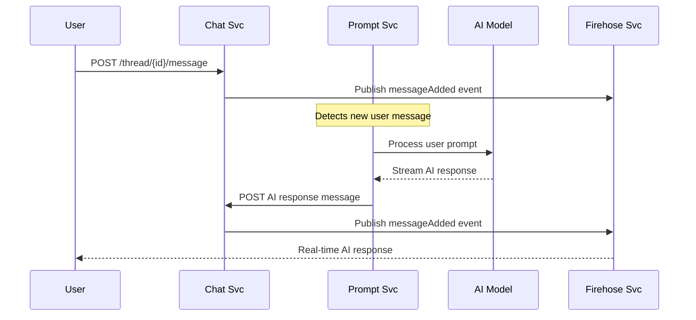

# Chat Svc

The Chat Svc manages conversational threads and messages, serving as the primary interface for AI-powered chat applications and user interactions with LLM systems.

> This page provides a comprehensive overview of `Chat Svc`. For detailed API information, refer to the [Chat Svc API documentation](/docs/1backend-api/save-message).

## Architecture & Design

The Chat Svc follows a **thread-based conversation model** where:

- **Threads** represent conversation sessions or topics
- **Messages** are individual pieces of content within threads
- **Users** can participate in multiple threads
- **AI responses** are seamlessly integrated via message creation

### Core Concepts

#### Threads

Conversation containers that group related messages together. Think of them as chat rooms or conversation sessions.

#### Messages  

Individual pieces of content within threads, supporting:

- Text content
- File attachments
- Metadata for extensibility
- User attribution (or AI-generated content)

#### Topics

Tag-like categorization system for organizing threads by subject or purpose.

## API Endpoints

### Thread Management

#### Create/Update Thread

```bash
POST /chat-svc/thread
```

Creates a new thread or updates an existing one.

**Request Body:**

```json
{
  "id": "thr_abc123",
  "title": "AI Assistant Conversation",
  "userIds": ["user_123", "user_456"],
  "topicIds": ["ai-help", "troubleshooting"]
}
```

**Response:**

```json
{
  "thread": {
    "id": "thr_abc123",
    "title": "AI Assistant Conversation", 
    "userIds": ["user_123", "user_456"],
    "topicIds": ["ai-help", "troubleshooting"],
    "createdAt": "2024-01-15T10:30:00Z",
    "updatedAt": "2024-01-15T10:30:00Z"
  }
}
```

#### List Threads

```bash
POST /chat-svc/threads
```

Retrieves threads accessible to the authenticated user.

**Request Body:**

```json
{
  "ids": ["thr_abc123", "thr_def456"]
}
```

#### Delete Thread

```bash
DELETE /chat-svc/thread/{threadId}
```

Permanently removes a thread and all its messages.

### Message Management

#### Add Message

```bash
POST /chat-svc/thread/{threadId}/message
```

Adds a new message to an existing thread.

**Request Body:**

```json
{
  "id": "msg_xyz789",
  "text": "Hello, I need help with my API integration",
  "userId": "user_123",
  "fileIds": ["file_attachment1"],
  "meta": {
    "priority": "high",
    "category": "support"
  }
}
```

#### List Messages

```bash
POST /chat-svc/messages
```

Retrieves messages from threads, with optional filtering.

**Request Body:**

```json
{
  "threadId": "thr_abc123",
  "ids": ["msg_xyz789"]
}
```

**Response:**

```json
{
  "messages": [
    {
      "id": "msg_xyz789",
      "threadId": "thr_abc123", 
      "text": "Hello, I need help with my API integration",
      "userId": "user_123",
      "fileIds": ["file_attachment1"],
      "meta": {"priority": "high"},
      "createdAt": "2024-01-15T10:35:00Z",
      "updatedAt": "2024-01-15T10:35:00Z"
    }
  ]
}
```

#### Delete Message

```bash
DELETE /chat-svc/message/{messageId}
```

Removes a specific message from its thread.

### Events Endpoint

```bash
GET /chat-svc/events
```

Documentation endpoint showing available real-time events.

## Real-Time Features

Chat Svc publishes events through Firehose Svc for real-time applications:

### Event Types

#### Thread Events

- **`chatThreadAdded`** - New thread created
- **`chatThreadUpdate`** - Thread modified (title, users, topics)

#### Message Events  

- **`chatMessageAdded`** - New message posted to thread

### Event Structure

```json
{
  "name": "chatMessageAdded",
  "data": {
    "threadId": "thr_abc123"
  }
}
```

## AI Integration

### Prompt Svc Integration

Chat Svc seamlessly integrates with [Prompt Svc](/docs/built-in-services/prompt-svc) for AI-powered conversations:

1. **User sends message** → Chat Svc stores user message
2. **AI processing** → Prompt Svc processes via LLM
3. **AI response** → Chat Svc receives and stores AI message
4. **Real-time delivery** → Events notify clients of new messages

### AI Message Flow



### Streaming AI Responses

For real-time AI interactions, Chat Svc supports:

- **Progressive responses** via streaming chunks
- **Real-time updates** as AI generates content
- **Completion events** when AI finishes responding

## File Attachments

Messages support file attachments through integration with [File Svc](/docs/built-in-services/file-svc):

```json
{
  "text": "Here's the document you requested",
  "fileIds": [
    "file_document1.pdf",
    "file_screenshot.png", 
    "file_data.csv"
  ]
}
```

File attachments enable:

- **Document sharing** in conversations
- **Image/media** support for rich interactions
- **AI analysis** of uploaded content
- **Persistent storage** of conversation assets

## Usage Examples

### Creating a Chat Application

#### 1. Start a New Conversation

```bash
# Create a thread for AI assistance
curl -X POST "http://localhost:11337/chat-svc/thread" \
  -H "Authorization: Bearer $TOKEN" \
  -H "Content-Type: application/json" \
  -d '{
    "title": "AI Code Review",
    "topicIds": ["development", "code-review"]
  }'
```

#### 2. Send User Message

```bash
# Add user message to thread
curl -X POST "http://localhost:11337/chat-svc/thread/thr_abc123/message" \
  -H "Authorization: Bearer $TOKEN" \
  -H "Content-Type: application/json" \
  -d '{
    "text": "Can you review this JavaScript function?",
    "fileIds": ["file_code.js"]
  }'
```

#### 3. List Conversation History

```bash
# Get all messages in the thread
curl -X POST "http://localhost:11337/chat-svc/messages" \
  -H "Authorization: Bearer $TOKEN" \
  -H "Content-Type: application/json" \
  -d '{
    "threadId": "thr_abc123"
  }'
```

### Multi-User Conversations

```bash
# Create a team discussion thread
curl -X POST "http://localhost:11337/chat-svc/thread" \
  -H "Authorization: Bearer $TOKEN" \
  -H "Content-Type: application/json" \
  -d '{
    "title": "Project Planning Session",
    "userIds": ["user_alice", "user_bob", "user_charlie"],
    "topicIds": ["planning", "project-alpha"]
  }'
```

### AI Assistant Integration

```javascript
// Subscribe to real-time events for AI responses
const eventSource = new EventSource('/firehose-svc/events');

eventSource.addEventListener('chatMessageAdded', (event) => {
  const data = JSON.parse(event.data);
  
  // Fetch the new message
  fetch('/chat-svc/messages', {
    method: 'POST',
    headers: { 'Authorization': `Bearer ${token}` },
    body: JSON.stringify({ 
      threadId: data.threadId 
    })
  })
  .then(response => response.json())
  .then(messages => {
    // Update UI with new message
    displayNewMessage(messages.messages[0]);
  });
});

// Send message and trigger AI response
async function sendMessage(threadId, text) {
  // Add user message
  await fetch(`/chat-svc/thread/${threadId}/message`, {
    method: 'POST',
    headers: { 'Authorization': `Bearer ${token}` },
    body: JSON.stringify({ text })
  });
  
  // Trigger AI processing (Prompt Svc will handle automatically)
}
```

### Topic-Based Organization

```bash
# Create threads with specific topics for organization
curl -X POST "http://localhost:11337/chat-svc/thread" \
  -H "Authorization: Bearer $TOKEN" \
  -d '{
    "title": "Bug Reports",
    "topicIds": ["bugs", "frontend", "urgent"]
  }'

curl -X POST "http://localhost:11337/chat-svc/thread" \
  -H "Authorization: Bearer $TOKEN" \
  -d '{
    "title": "Feature Requests", 
    "topicIds": ["features", "enhancement", "v2.0"]
  }'
```

## Access Control

Chat Svc uses comprehensive permission-based access control:

### Thread Permissions

- **`chat-svc:thread:create`** - Create new threads
- **`chat-svc:thread:view`** - View thread information
- **`chat-svc:thread:edit`** - Modify thread properties
- **`chat-svc:thread:delete`** - Delete threads
- **`chat-svc:thread:stream`** - Subscribe to thread events

### Message Permissions

- **`chat-svc:message:create`** - Add messages to threads
- **`chat-svc:message:view`** - Read messages
- **`chat-svc:message:edit`** - Modify messages
- **`chat-svc:message:delete`** - Remove messages
- **`chat-svc:message:stream`** - Subscribe to message events

### Default Access

By default, permissions are granted to:

- **Administrators** - Full access to all operations
- **Regular Users** - Access to threads they participate in

### User-Based Filtering

- Users can only see threads where they are listed in `userIds`
- Message access is controlled by thread membership
- Thread creators automatically gain access

## Data Models

### Thread Structure

```json
{
  "id": "thr_emSQnpJbhG",
  "title": "Conversation Title",
  "userIds": ["user1", "user2"],
  "topicIds": ["topic1", "topic2"], 
  "createdAt": "2024-01-15T10:30:00Z",
  "updatedAt": "2024-01-15T10:30:00Z"
}
```

### Message Structure

```json
{
  "id": "msg_emSOPlW58o",
  "threadId": "thr_emSQnpJbhG",
  "text": "Message content",
  "userId": "user_123",
  "fileIds": ["file1", "file2"],
  "meta": {
    "customField": "value",
    "priority": "high"
  },
  "createdAt": "2024-01-15T10:35:00Z",
  "updatedAt": "2024-01-15T10:35:00Z"
}
```

### AI Messages

AI-generated messages have specific characteristics:

- **`userId`** is empty (indicates AI origin)
- **`meta`** contains model information:

  ```json
  {
    "modelId": "huggingface/llama-model",
    "platformId": "llama-cpp"
  }
  ```

## Integration Patterns

### Frontend Applications

- **Real-time chat interfaces** using WebSocket events
- **Progressive AI responses** with streaming updates  
- **File sharing** within conversations
- **Thread organization** by topics

### Backend Services

- **AI model integration** via Prompt Svc
- **Automated responses** to user messages
- **Content analysis** of uploaded files
- **Conversation analytics** and insights

### Mobile Applications

- **Push notifications** for new messages
- **Offline message queuing** with eventual consistency
- **Rich media support** for attachments
- **Cross-platform synchronization**

## Performance & Scalability

### Optimizations

- **Pagination** for large message lists
- **Indexing** on threadId and userId for fast queries
- **Caching** of frequently accessed threads
- **Event batching** for high-volume scenarios

### Best Practices

- **Limit message size** for optimal performance
- **Use topics** for efficient thread organization
- **Implement pagination** for message history
- **Subscribe selectively** to relevant events only

## Troubleshooting

### Common Issues

**Messages Not Appearing**

- Verify thread exists before adding messages
- Check user permissions for thread access
- Ensure proper event subscription setup

**AI Responses Not Generated**

- Confirm Prompt Svc integration is active
- Verify AI model is running and accessible
- Check message format matches AI expectations

**Real-time Events Missing**

- Validate Firehose Svc connectivity
- Ensure proper event subscription to correct thread
- Check authentication tokens for event access

**File Attachments Not Loading**

- Verify File Svc integration and file existence
- Check file permissions and access rights
- Confirm fileIds are valid references

## Related Services

- **[Prompt Svc](/docs/built-in-services/prompt-svc)** - AI conversation processing
- **[File Svc](/docs/built-in-services/file-svc)** - File attachment management
- **Firehose Svc** - Real-time event streaming
- **[User Svc](/docs/built-in-services/user-svc)** - User authentication and authorization
