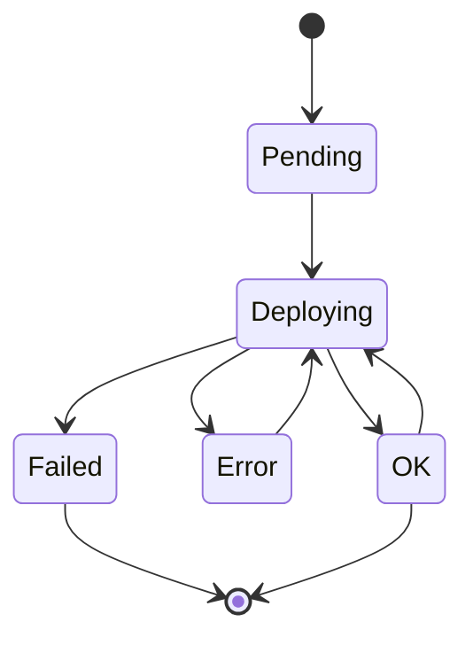
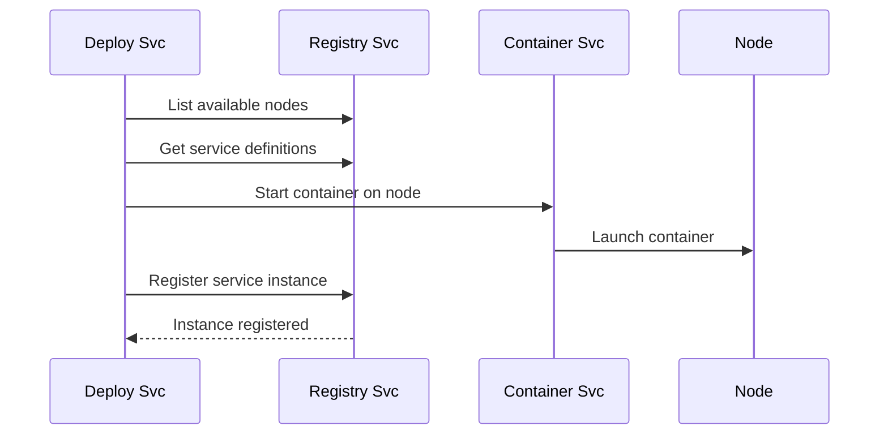

# Deploy Svc

The Deploy Svc is a container orchestration service that automates the deployment, scaling, and management of containerized services across 1Backend infrastructure.

> This page provides a comprehensive overview of `Deploy Svc`. For detailed API information, refer to the [Deploy Svc API documentation](/docs/1backend-api/save-deployment).

## Architecture & Purpose

Deploy Svc serves as the **orchestration layer** that bridges service definitions and running containers:

- **Automated Deployment**: Launches containers based on service definitions
- **Intelligent Scaling**: Manages replica counts and resource allocation
- **Health Monitoring**: Tracks service health and restarts failed instances
- **Load Distribution**: Distributes services across available nodes
- **Lifecycle Management**: Handles deployments, updates, and rollbacks

### Key Components

- **Deployments**: Desired state specifications for running services
- **Allocator**: Smart scheduling engine for optimal resource distribution
- **Deploy Loop**: Continuous reconciliation between desired and actual state
- **Integration Layer**: Seamless coordination with Container Svc and Registry Svc

## Status Warning

**🚧 Deployment capabilities are currently in development. This documentation is for contributors and advanced users. For production use, deploy services manually for now.**

## CLI Usage

Deploy Svc provides comprehensive CLI commands for managing deployments:

### Saving Deployments

```bash
# Save a deployment from YAML file
oo deployment save ./my-deployment.yaml

# Using aliases
oo depl s ./my-deployment.yaml
oo deployments save ./my-deployment.yaml
```

#### Deployment File Structure

Deployment files should be in YAML format with the following structure:

```yaml
id: "depl_myservice123"
definitionId: "def_myservice456"  # Links to Registry Svc Definition
name: "user-service-v2"
description: "Handles user service requests"
replicas: 3
strategy:
  type: "RollingUpdate"
  maxUnavailable: 1
  maxSurge: 2
resources:
  cpu: "500m"       # 0.5 CPU cores
  memory: "256Mi"   # 256 MB RAM
  vram: "24GB"      # GPU memory (optional)
autoScaling:
  minReplicas: 2
  maxReplicas: 10
  cpuThreshold: 80  # Scale up at 80% CPU
targetRegions:
  - cluster: "us-west1"
    zone: "us-west1-b"
  - cluster: "local-docker"
envars:
  ENVIRONMENT: "production"
  LOG_LEVEL: "debug"
  FEATURE_FLAG_X: "true"
  DATABASE_URL: "postgres://localhost:5432/mydb"
```

#### Minimal Deployment Example

```yaml
id: "depl_simple123"
definitionId: "def_myapp456"
replicas: 1
```

### Listing Deployments

```bash
# List all deployments
oo deployment list

# List with full details (no truncation)
oo deployment list --full

# Using aliases
oo depl ls
oo deployments list --full
```

Example output:
```
ID                DEFINITION ID    STATUS      DETAILS
depl_dbOdi5eLQK   test-a          OK          
depl_dy2PDIkzqf   test-b          Error       build failed: COPY failed: file not found...
depl_user123      def_user456     Deploying   Starting container instances...
```

### Deleting Deployments

```bash
# Delete a deployment by ID
oo deployment remove depl_myservice123

# Using aliases
oo depl rm depl_myservice123
oo deployments remove depl_myservice123
```

## Deployment Lifecycle

### Deployment States

Deploy Svc manages deployments through several states:



- **Pending**: Deployment created but not yet started
- **Deploying**: Actively launching or updating containers
- **OK**: All replicas running successfully
- **Error**: Deployment failed but retryable
- **Failed**: Deployment permanently failed

### Deploy Loop Operation

The Deploy Svc runs a continuous reconciliation loop:

1. **State Assessment**: Compare desired vs actual deployments
2. **Command Generation**: Create start/stop/scale commands
3. **Node Allocation**: Distribute workloads across available nodes
4. **Container Management**: Execute commands via Container Svc
5. **Registry Updates**: Register instances with Registry Svc
6. **Health Monitoring**: Track instance health and restart if needed

## Scaling & Resource Management

### Replica Management

```yaml
# Basic scaling
replicas: 5

# Auto-scaling configuration
autoScaling:
  minReplicas: 2
  maxReplicas: 20
  cpuThreshold: 75  # Scale up when average CPU > 75%
```

### Resource Allocation

```yaml
resources:
  cpu: "2"          # 2 CPU cores
  memory: "4Gi"     # 4 GB RAM
  vram: "48GB"      # GPU memory for AI workloads
```

#### Resource Format Examples

```yaml
# CPU formats
cpu: "500m"      # 0.5 cores (millicores)
cpu: "1"         # 1 core
cpu: "2.5"       # 2.5 cores

# Memory formats
memory: "128Mi"  # 128 mebibytes
memory: "1Gi"    # 1 gibibyte
memory: "512M"   # 512 megabytes

# GPU VRAM (for AI workloads)
vram: "24GB"     # 24 GB GPU memory
vram: "48GB"     # High-memory GPU
```

## Deployment Strategies

### Rolling Update (Default)

```yaml
strategy:
  type: "RollingUpdate"
  maxUnavailable: 1     # Max instances down during update
  maxSurge: 2          # Max extra instances during update
```

Rolling updates ensure **zero-downtime deployments** by:
1. Starting new instances alongside old ones
2. Gradually shifting traffic to new instances
3. Removing old instances once new ones are healthy

### Recreate Strategy

```yaml
strategy:
  type: "Recreate"
```

Recreate strategy **stops all instances** before starting new ones:
- Simpler but causes downtime
- Useful for stateful services requiring exclusive access
- Faster for development environments

## Real-World Usage Examples

### 1. Web Application Deployment

```yaml
id: "depl_webapp_prod"
definitionId: "def_webapp_v2"
name: "webapp-production"
description: "Production web application"
replicas: 5
strategy:
  type: "RollingUpdate"
  maxUnavailable: 1
  maxSurge: 2
resources:
  cpu: "1"
  memory: "512Mi"
autoScaling:
  minReplicas: 3
  maxReplicas: 15
  cpuThreshold: 70
targetRegions:
  - cluster: "us-east1"
  - cluster: "us-west1"
envars:
  NODE_ENV: "production"
  DATABASE_URL: "postgres://prod-db:5432/webapp"
  REDIS_URL: "redis://prod-cache:6379"
  LOG_LEVEL: "info"
```

### 2. AI Model Service

```yaml
id: "depl_ai_model"
definitionId: "def_llama_70b"
name: "llama-70b-service"
description: "Large language model inference service"
replicas: 2
resources:
  cpu: "8"
  memory: "32Gi"
  vram: "80GB"    # High-end GPU requirement
autoScaling:
  minReplicas: 1
  maxReplicas: 4
  cpuThreshold: 85
targetRegions:
  - cluster: "gpu-cluster-a100"
    zone: "gpu-zone-1"
envars:
  MODEL_NAME: "llama-70b"
  BATCH_SIZE: "4"
  MAX_TOKENS: "4096"
  GPU_MEMORY_FRACTION: "0.95"
```

### 3. Microservice with Database

```yaml
id: "depl_user_service"
definitionId: "def_user_api"
name: "user-service"
description: "User management microservice"
replicas: 3
strategy:
  type: "RollingUpdate"
  maxUnavailable: 0    # Zero downtime
  maxSurge: 1
resources:
  cpu: "500m"
  memory: "256Mi"
autoScaling:
  minReplicas: 2
  maxReplicas: 8
  cpuThreshold: 75
envars:
  DATABASE_HOST: "user-db.internal"
  DATABASE_PORT: "5432"
  DATABASE_NAME: "users"
  JWT_SECRET: "{{secret:jwt-secret}}"
  REDIS_URL: "redis://user-cache:6379"
```

### 4. Development Environment

```yaml
id: "depl_dev_api"
definitionId: "def_api_dev"
name: "api-development"
description: "Development API server"
replicas: 1          # Single instance for dev
strategy:
  type: "Recreate"   # Simpler for development
resources:
  cpu: "250m"        # Minimal resources
  memory: "128Mi"
envars:
  NODE_ENV: "development"
  DEBUG: "true"
  HOT_RELOAD: "true"
  LOG_LEVEL: "debug"
```

## Node Allocation & Targeting

### Cluster Targeting

```yaml
targetRegions:
  - cluster: "production-cluster"
    zone: "zone-a"
  - cluster: "gpu-cluster"      # For GPU workloads
  - cluster: "local-docker"     # For local development
```

### Allocation Algorithm

The Deploy Svc allocator considers:

1. **Node Capacity**: CPU, memory, and GPU availability
2. **Resource Requirements**: Deployment resource needs
3. **Load Distribution**: Balanced workload distribution
4. **Affinity Rules**: Cluster and zone preferences
5. **Health Status**: Only healthy nodes receive workloads

## Integration with Other Services

### Registry Svc Integration

Deploy Svc works closely with [Registry Svc](/docs/built-in-services/registry-svc):



### Container Svc Integration

Deploy Svc orchestrates containers via [Container Svc](/docs/built-in-services/container-svc):

- **Container Lifecycle**: Start, stop, and restart containers
- **Image Management**: Build images from repositories
- **Port Mapping**: Configure network access
- **Volume Mounting**: Handle persistent storage

### Definition Dependency

Deployments reference **Service Definitions** from Registry Svc:

```bash
# First, create a definition
oo definition save ./my-service-def.yaml

# Then, deploy it
oo deployment save ./my-deployment.yaml
```

## Environment Variables & Configuration

### Static Configuration

```yaml
envars:
  NODE_ENV: "production"
  LOG_LEVEL: "info"
  API_TIMEOUT: "30s"
  MAX_CONNECTIONS: "100"
```

### Dynamic Configuration

```yaml
envars:
  # Reference secrets (when Secret Svc integration available)
  DATABASE_PASSWORD: "{{secret:db-password}}"
  API_KEY: "{{secret:external-api-key}}"
  
  # Environment-specific values
  ENVIRONMENT: "{{env:DEPLOY_ENV}}"
  BUILD_VERSION: "{{env:BUILD_NUMBER}}"
```

## Monitoring & Observability

### Deployment Status Monitoring

```bash
# Watch deployment progress
oo deployment list --full

# Check specific deployment
oo deployment list | grep depl_myservice123
```

### Health Check Integration

Deploy Svc monitors service health through:

- **Container Health**: Container runtime status
- **Service Heartbeats**: Regular health check responses
- **Resource Usage**: CPU, memory, and GPU utilization
- **Network Connectivity**: Service reachability

### Automatic Recovery

When services fail, Deploy Svc automatically:

1. **Detects Failures**: Via health checks and heartbeats
2. **Generates Commands**: Create restart/replace commands
3. **Allocates Resources**: Find available nodes
4. **Restarts Services**: Launch replacement containers
5. **Updates Registry**: Register new instances

## Performance Optimization

### Resource Efficiency

```yaml
# Optimize resource allocation
resources:
  cpu: "500m"        # Right-size CPU allocation
  memory: "256Mi"    # Prevent memory waste
  
# Configure appropriate scaling
autoScaling:
  minReplicas: 2     # Maintain minimum availability
  maxReplicas: 8     # Cap maximum resources
  cpuThreshold: 70   # Scale before hitting limits
```

### Deployment Speed

```yaml
# Fast deployment strategy
strategy:
  type: "RollingUpdate"
  maxUnavailable: 0   # Zero downtime
  maxSurge: 3         # Parallel deployments
```

## Troubleshooting

### Common Issues

#### **Deployment Stuck in "Deploying"**
```bash
# Check node availability
oo node list

# Verify definition exists
oo definition list

# Check container logs
oo get /container-svc/container/summary?name=my-service
```

#### **"Error" Status with Build Failures**
```bash
# Check definition for correct paths
cat my-definition.yaml

# Verify repository access
oo get /source-svc/checkout --url="https://github.com/user/repo.git"
```

#### **Resource Allocation Failures**
```yaml
# Reduce resource requirements
resources:
  cpu: "250m"      # Reduced from "1"
  memory: "128Mi"  # Reduced from "512Mi"
```

### Debug Commands

```bash
# List all nodes and their capacity
oo node list

# Check instance health
oo instance list

# View deployment details
oo deployment list --full
```

## API Reference Summary

| Endpoint | Method | Purpose |
|----------|---------|---------|
| `/deploy-svc/deployment` | PUT | Save/update deployment |
| `/deploy-svc/deployments` | POST | List deployments |
| `/deploy-svc/deployment` | DELETE | Delete deployment |

## Related Services

- **[Registry Svc](/docs/built-in-services/registry-svc)**: Service definitions and instance registry
- **[Container Svc](/docs/built-in-services/container-svc)**: Container runtime management
- **[Config Svc](/docs/built-in-services/config-svc)**: Configuration management
- **[Secret Svc](/docs/built-in-services/secret-svc)**: Secure configuration storage

## Roadmap & Future Features

The Deploy Svc is actively evolving with planned features:

### Near-term Enhancements
- **Blue-Green Deployments**: Zero-downtime deployment strategy
- **Canary Releases**: Gradual traffic shifting
- **Resource Quotas**: Per-service resource limits
- **Health Check Configuration**: Custom health check endpoints

### Long-term Vision
- **Multi-Cloud Support**: Deploy across cloud providers
- **Advanced Scheduling**: Affinity and anti-affinity rules
- **Persistent Volumes**: Stateful service support
- **Service Mesh Integration**: Advanced networking features

For production deployments, monitor the project roadmap and consider manual deployment approaches until Deploy Svc reaches production readiness.
