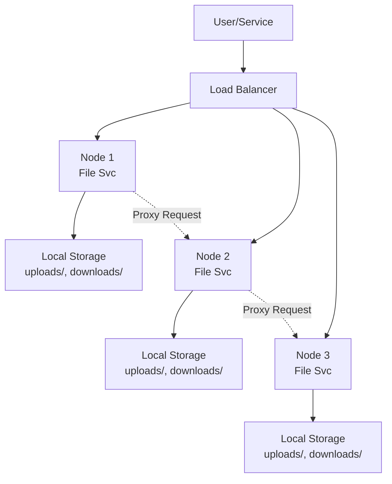

# File Svc

The File Svc is a distributed file storage and caching service that handles file uploads, downloads from external URLs, and content delivery across the 1Backend infrastructure.

> This page provides a comprehensive overview of `File Svc`. For detailed API information, refer to the [File Svc API documentation](/docs/1backend-api/download-file).

## Architecture & Purpose

File Svc serves as the **content management layer** for 1Backend, providing:

- **Distributed Storage**: Files are replicated across multiple nodes for reliability
- **URL Caching**: Downloads and caches external files for faster access
- **Upload Management**: Handles multipart file uploads from clients
- **Content Delivery**: Serves files with proper MIME types and headers
- **Asset Integration**: Automatically provides files to containers and services

### Key Features

- **Multi-Node Distribution**: Files stored across different nodes with automatic replication
- **Smart Proxying**: Serves files from the nearest available node
- **Resume Support**: Partial downloads with resume capability
- **Security**: File access controls and secure file ID generation
- **Performance**: Intelligent caching and streaming for optimal delivery

## CLI Usage

File Svc doesn't have dedicated CLI commands. Instead, use the generic HTTP commands to interact with the API endpoints:

### Downloading & Caching Files

```bash
# Download and cache a file from URL
oo put /file-svc/download \
  --url="https://example.com/large-model.gguf" \
  --folderPath="/downloads"

# Get download status
oo get /file-svc/download/https%3A%2F%2Fexample.com%2Flarge-model.gguf

# List all downloads
oo post /file-svc/downloads

# Pause a download
oo put /file-svc/download/https%3A%2F%2Fexample.com%2Flarge-model.gguf/pause
```

### File Uploads

```bash
# Upload a file using curl (multipart form data)
curl -X PUT "http://localhost:11337/file-svc/upload" \
  -H "Authorization: Bearer $TOKEN" \
  -F "file=@./my-document.pdf"

# List uploaded files
oo post /file-svc/uploads \
  --userId="usr_12345"
```

### Serving Files

```bash
# Serve an uploaded file by file ID
curl "http://localhost:11337/file-svc/serve/upload/file_abc123xyz"

# Serve a downloaded file by URL
curl "http://localhost:11337/file-svc/serve/download/https%3A%2F%2Fexample.com%2Fmodel.gguf"

# Using with browser (downloads with proper filename)
open "http://localhost:11337/file-svc/serve/upload/file_abc123xyz"
```

## Distributed Architecture

### Multi-Node Storage

File Svc operates in a **distributed manner**:



### File Replication & Access

- **Upload Replicas**: Files can be stored on multiple nodes
- **Smart Routing**: Requests automatically routed to nodes with the file
- **Transparent Proxying**: If a file isn't local, the request is proxied to the correct node
- **Unique File IDs**: Files have both local IDs and global file IDs for distributed access

### Node-Local Folders

Each File Svc node maintains:

```
~/.1backend/
├── uploads/          # User uploaded files
└── downloads/        # Cached external files
```

## File Types & Management

### Downloads (External Files)

Downloads are external files cached locally for performance:

```bash
# Download an AI model
oo put /file-svc/download \
  --url="https://huggingface.co/microsoft/DialoGPT-medium/resolve/main/pytorch_model.bin" \
  --folderPath="/models"

# Check download progress
oo get /file-svc/download/https%3A%2F%2Fhuggingface.co%2Fmicrosoft%2FDialoGPT-medium%2Fresolve%2Fmain%2Fpytorch_model.bin
```

**Response Example:**

```json
{
  "exists": true,
  "download": {
    "id": "down_abc123",
    "url": "https://huggingface.co/microsoft/DialoGPT-medium/resolve/main/pytorch_model.bin",
    "fileName": "pytorch_model.bin",
    "progress": 75.5,
    "downloadedBytes": 890234567,
    "fileSize": 1179648000,
    "status": "InProgress",
    "filePath": "/root/.1backend/downloads/encoded_filename"
  }
}
```

### Uploads (User Files)

Uploads are files submitted by users or services:

```bash
# List user uploads
oo post /file-svc/uploads \
  --userId="usr_12345"
```

**Response Example:**

```json
{
  "uploads": [
    {
      "id": "upl_xyz789",
      "fileId": "file_abc123def",
      "fileName": "profile-picture.jpg",
      "fileSize": 2048576,
      "userId": "usr_12345",
      "nodeId": "node_server01",
      "createdAt": "2023-01-01T10:00:00Z"
    }
  ]
}
```

## Integration Patterns

### Container Assets (AI Models)

File Svc automatically integrates with [Container Svc](/docs/built-in-services/container-svc) for AI model downloads:

```json
{
  "image": "llama-cpp-python:latest",
  "assets": [
    {
      "envVarKey": "MODEL_PATH",
      "url": "https://huggingface.co/TheBloke/Mistral-7B-Instruct-v0.2-GGUF/resolve/main/mistral-7b-instruct-v0.2.Q4_K_M.gguf"
    }
  ]
}
```

**Flow:**

1. Container Svc requests the model file from File Svc
2. File Svc downloads and caches the model if not present
3. File is served to Container Svc and mounted in the container
4. Environment variable `MODEL_PATH` points to the file location

### Chat & File Attachments

Integration with [Chat Svc](/docs/built-in-services/chat-svc) for message attachments:

```bash
# Upload attachment
curl -X PUT "http://localhost:11337/file-svc/upload" \
  -H "Authorization: Bearer $TOKEN" \
  -F "file=@./document.pdf"

# Use file ID in chat message
oo post /chat-svc/thread/thread_123/message \
  --text="Here's the document" \
  --fileIds='["file_abc123def"]'
```

### Data Svc Integration

Store file references in [Data Svc](/docs/built-in-services/data-svc) objects:

```bash
# Create object with file references
oo post /data-svc/object \
  --object.table="document" \
  --object.readers="_self" \
  --object.data.title="Project Report" \
  --object.data.attachments='["file_report123", "file_charts456"]'
```

## Real-World Usage Examples

### 1. AI Model Management

```bash
# Download a large language model
oo put /file-svc/download \
  --url="https://huggingface.co/microsoft/DialoGPT-large/resolve/main/pytorch_model.bin" \
  --folderPath="/models/dialogpt"

# Check download progress
oo get /file-svc/download/https%3A%2F%2Fhuggingface.co%2Fmicrosoft%2FDialoGPT-large%2Fresolve%2Fmain%2Fpytorch_model.bin

# Monitor until complete
watch -n 5 'oo post /file-svc/downloads | grep -A 10 "DialoGPT"'

# Once complete, use in container
oo put /container-svc/container \
  --image="my-ai-service:latest" \
  --assets='[{"envVarKey": "MODEL_PATH", "url": "https://huggingface.co/microsoft/DialoGPT-large/resolve/main/pytorch_model.bin"}]'
```

### 2. Document Management System

```bash
# Upload user documents
curl -X PUT "http://localhost:11337/file-svc/upload" \
  -H "Authorization: Bearer $TOKEN" \
  -F "file=@./contract.pdf" \
  -F "file=@./invoice.xlsx"

# List user's documents
oo post /file-svc/uploads \
  --userId="usr_company123"

# Store document metadata in Data Svc
oo post /data-svc/object \
  --object.table="document" \
  --object.readers='["org_company123"]' \
  --object.data.title="Q4 Contract" \
  --object.data.fileId="file_contract789" \
  --object.data.category="legal" \
  --object.data.uploadedBy="usr_john456"
```

### 3. Content Delivery Network

```bash
# Cache frequently accessed files
oo put /file-svc/download \
  --url="https://cdn.example.com/assets/logo.png" \
  --folderPath="/cdn-cache"

oo put /file-svc/download \
  --url="https://cdn.example.com/assets/style.css" \
  --folderPath="/cdn-cache"

# Serve cached content (much faster than original CDN)
curl "http://localhost:11337/file-svc/serve/download/https%3A%2F%2Fcdn.example.com%2Fassets%2Flogo.png"
```

### 4. Backup & Migration

```bash
# Download backup files
oo put /file-svc/download \
  --url="https://backups.mycompany.com/database-backup-2023-12.sql.gz" \
  --folderPath="/backups"

# Upload processed files
curl -X PUT "http://localhost:11337/file-svc/upload" \
  -H "Authorization: Bearer $TOKEN" \
  -F "file=@./processed-data.csv"

# List all cached backups
oo post /file-svc/downloads | grep backup
```

### 5. Multi-Media Processing

```bash
# Download video for processing
oo put /file-svc/download \
  --url="https://example.com/raw-video.mp4" \
  --folderPath="/media/input"

# Process and upload result
# (after processing with video service)
curl -X PUT "http://localhost:11337/file-svc/upload" \
  -H "Authorization: Bearer $TOKEN" \
  -F "file=@./processed-video.mp4"

# Create media object with references
oo post /data-svc/object \
  --object.table="media" \
  --object.readers="_self" \
  --object.data.title="Processed Video" \
  --object.data.originalFile="https://example.com/raw-video.mp4" \
  --object.data.processedFileId="file_processed123"
```

## File Serving & Content Delivery

### Content Headers

File Svc automatically sets appropriate headers:

```http
Content-Type: application/pdf
Content-Disposition: attachment; filename="document.pdf"
Content-Length: 2048576
```

### Direct File Access

```bash
# Serve file directly (downloads with proper filename)
curl -O -J "http://localhost:11337/file-svc/serve/upload/file_abc123def"

# Serve with custom application
wget "http://localhost:11337/file-svc/serve/download/https%3A%2F%2Fexample.com%2Ffile.zip"

# Embed in web pages
# 
```

### Streaming & Performance

- **Progressive Download**: Large files stream as they download
- **Resume Support**: Interrupted downloads can resume from where they left off
- **MIME Detection**: Automatic content-type detection from file extensions
- **Efficient Proxying**: Minimal overhead when proxying between nodes

## File Security & Access Control

### Secure File IDs

```bash
# File IDs are cryptographically secure
file_8kJ9pL2mN5qR7sT1vU3wX6yZ4aB7cD9eF2gH5iJ8k
```

- **Non-enumerable**: Cannot guess other file IDs
- **Globally unique**: Safe across distributed system
- **Opaque**: No information leaked about file contents

### Permission System

File operations require specific permissions:

```bash
# Download permissions
file-svc:download:create    # Start downloads
file-svc:download:view      # List and check downloads

# Upload permissions  
file-svc:upload:create      # Upload files
file-svc:upload:view        # List uploads
```

### Service Integration Permissions

```bash
# Container Svc can download assets
model-svc -> file-svc:download:create
model-svc -> file-svc:download:view

# Prompt Svc can handle file uploads
prompt-svc -> file-svc:upload:create
```

## Performance Optimization

### Caching Strategy

```bash
# Pre-download frequently used files
oo put /file-svc/download \
  --url="https://cdn.example.com/frequently-used.js" \
  --folderPath="/cache"

# Batch download related files
oo put /file-svc/download \
  --url="https://example.com/model.gguf" \
  --folderPath="/models"

oo put /file-svc/download \
  --url="https://example.com/tokenizer.json" \
  --folderPath="/models"
```

### Bandwidth Management

```bash
# Monitor download progress
oo get /file-svc/download/https%3A%2F%2Fexample.com%2Flarge-file.zip

# Pause heavy downloads during peak hours
oo put /file-svc/download/https%3A%2F%2Fexample.com%2Flarge-file.zip/pause

# Resume when bandwidth available
oo put /file-svc/download \
  --url="https://example.com/large-file.zip" \
  --folderPath="/downloads"
```

## Monitoring & Observability

### Download Status Tracking

```bash
# List all downloads with status
oo post /file-svc/downloads
```

**Status Values:**

- `Pending`: Download queued but not started
- `InProgress`: Currently downloading
- `Completed`: Download finished successfully
- `Paused`: Download temporarily paused
- `Failed`: Download failed (can be retried)

### Upload Management

```bash
# Monitor user uploads
oo post /file-svc/uploads \
  --userId="usr_12345"

# Check storage usage per user
oo post /file-svc/uploads | jq '.uploads | group_by(.userId) | map({user: .[0].userId, count: length, totalSize: map(.fileSize) | add})'
```

### Node Distribution

```bash
# Check which nodes have which files
oo post /file-svc/uploads | jq '.uploads | group_by(.nodeId)'

# Monitor download distribution
oo post /file-svc/downloads | jq '.downloads | group_by(.nodeId // "unknown")'
```

## Troubleshooting

### Common Issues

#### **Download Failures**

```bash
# Check download status
oo get /file-svc/download/https%3A%2F%2Fexample.com%2Ffile.zip

# Retry failed download
oo put /file-svc/download \
  --url="https://example.com/file.zip" \
  --folderPath="/downloads"
```

#### **File Not Found Errors**

```bash
# Verify file exists across nodes
oo post /file-svc/uploads | grep "file_abc123"

# Check download replicas
oo post /file-svc/downloads | grep "example.com/file.zip"
```

#### **Upload Permission Errors**

```bash
# Verify user permissions
oo get /user-svc/permits | grep "file-svc:upload"

# Check authentication
oo whoami
```

### Debug Commands

```bash
# List all file operations
oo post /file-svc/uploads
oo post /file-svc/downloads

# Check specific file by ID
curl -I "http://localhost:11337/file-svc/serve/upload/file_abc123"

# Verify URL encoding for downloads
node -e "console.log(encodeURIComponent('https://example.com/file.zip'))"
```

## Storage Management

### Disk Usage

File Svc stores files in predictable locations:

```bash
# Check upload storage usage
du -sh ~/.1backend/uploads/

# Check download cache usage  
du -sh ~/.1backend/downloads/

# Clean up old downloads (manual process)
find ~/.1backend/downloads/ -mtime +30 -delete
```

### File Lifecycle

1. **Downloads**: Cached indefinitely unless manually cleaned
2. **Uploads**: Persist until explicitly deleted
3. **Replicas**: Multiple copies may exist across nodes
4. **Cleanup**: Currently manual (automatic cleanup planned)

## API Reference Summary

| Endpoint | Method | Purpose |
|----------|---------|---------|
| `/file-svc/download` | PUT | Start/resume download from URL |
| `/file-svc/download/{url}` | GET | Get download status |
| `/file-svc/download/{url}/pause` | PUT | Pause active download |
| `/file-svc/downloads` | POST | List all downloads |
| `/file-svc/upload` | PUT | Upload file (multipart) |
| `/file-svc/uploads` | POST | List uploaded files |
| `/file-svc/serve/upload/{fileId}` | GET | Serve uploaded file |
| `/file-svc/serve/download/{url}` | GET | Serve downloaded file |

## Related Services

- **[Container Svc](/docs/built-in-services/container-svc)**: Automatic asset downloading for containers
- **[Chat Svc](/docs/built-in-services/chat-svc)**: File attachments in messages
- **[Data Svc](/docs/built-in-services/data-svc)**: Store file references in objects
- **[Model Svc](/docs/built-in-services/model-svc)**: AI model file management

## Future Enhancements

### Planned Features

- **Automatic Cleanup**: Configurable retention policies for cached files
- **Compression**: Automatic compression for large files
- **Deduplication**: Avoid storing duplicate files across nodes
- **Thumbnails**: Automatic thumbnail generation for images
- **Virus Scanning**: Optional malware detection for uploads

### Integration Roadmap

- **CDN Integration**: Direct integration with external CDNs
- **Cloud Storage**: Support for S3, Google Cloud, Azure blob storage
- **WebRTC**: Peer-to-peer file transfer for large files
- **Streaming**: Live video/audio streaming capabilities

File Svc provides the foundation for robust, distributed file management in 1Backend, supporting everything from AI model deployment to user content management.
