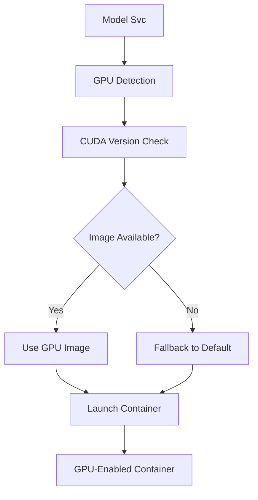
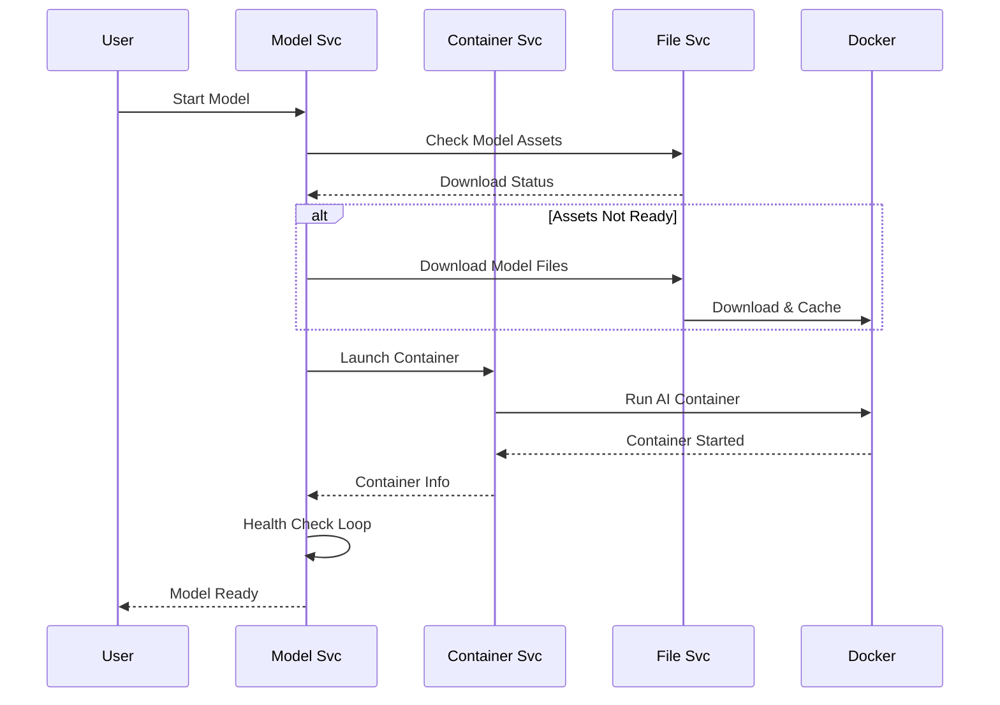
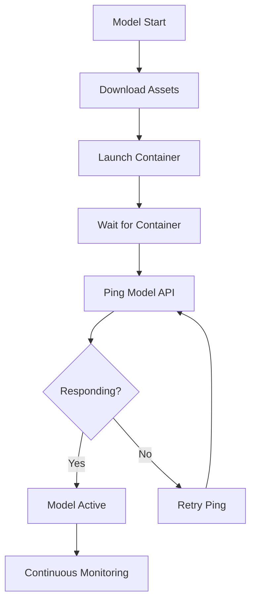

# Model Svc

The Model Svc is an AI model orchestration service that manages, deploys, and operates Large Language Models (LLMs) and other AI models across different runtime platforms with automatic GPU acceleration support.

> This page provides a comprehensive overview of `Model Svc`. For detailed API information, refer to the [Model Svc API documentation](/docs/1backend-api/start-default-model).

## Architecture & Purpose

Model Svc serves as the **AI model management layer** for 1Backend, providing:

- **Model Catalog**: Curated collection of popular AI models (Mistral, LLaMA, CodeLlama, etc.)
- **Platform Abstraction**: Support for different AI runtimes (LlamaCpp, Stable Diffusion)
- **Container Orchestration**: Automatic deployment via [Container Svc](/docs/built-in-services/container-svc)
- **Asset Management**: Model file downloading and caching via [File Svc](/docs/built-in-services/file-svc)
- **GPU Acceleration**: Automatic CUDA detection and optimization
- **Status Monitoring**: Real-time model health and readiness tracking

### Key Features

- **Multi-Platform Support**: LlamaCpp for text generation, Stable Diffusion for image generation
- **Smart GPU Detection**: Automatic CUDA version detection and image selection
- **Model Lifecycle**: Start, status monitoring, default model management
- **Resource Optimization**: Intelligent container sizing based on model requirements
- **Asset Caching**: Automatic model file downloading with resume support

## CLI Usage

Model Svc uses HTTP commands for all operations:

### Starting Models

```bash
# Start the default model
oo put /model-svc/default-model/start

# Start a specific model by ID
oo put /model-svc/model/huggingface%2FTheBloke%2Fmistral-7b-instruct-v0.2.Q4_K_M.gguf/start

# Start a lightweight model for testing
oo put /model-svc/model/huggingface%2FTheBloke%2Ftinyllama-1.1b-chat-v1.0.Q4_K_S.gguf/start

# Start Stable Diffusion for image generation
oo put /model-svc/model/nicklucche%2Fstable-diffusion/start
```

### Model Status & Monitoring

```bash
# Check default model status
oo get /model-svc/default-model/status

# Check specific model status
oo get /model-svc/model/huggingface%2FTheBloke%2Fmistral-7b-instruct-v0.2.Q4_K_M.gguf/status

# Get model details
oo get /model-svc/model/huggingface%2FTheBloke%2Fcodellama-7b.Q4_K_M.gguf
```

### Model Management

```bash
# List all available models
oo post /model-svc/models

# List AI platforms
oo post /model-svc/platforms

# Set default model
oo put /model-svc/model/huggingface%2FTheBloke%2Fmistral-7b-instruct-v0.2.Q4_K_M.gguf/make-default
```

### URL Encoding for Model IDs

Model IDs contain special characters that must be URL-encoded:

```bash
# Original ID: huggingface/TheBloke/mistral-7b-instruct-v0.2.Q4_K_M.gguf
# URL encoded: huggingface%2FTheBloke%2Fmistral-7b-instruct-v0.2.Q4_K_M.gguf

# Use this helper for encoding
echo "huggingface/TheBloke/mistral-7b-instruct-v0.2.Q4_K_M.gguf" | jq -rR @uri
```

## Platform Architecture

### AI Platforms

Model Svc supports multiple AI runtime platforms:

#### **LlamaCpp Platform**
```json
{
  "id": "llama-cpp",
  "name": "Llama CPP", 
  "types": ["text-to-text"],
  "architectures": {
    "default": {
      "container": {
        "imageTemplate": "crufter/llama-cpp-python:default-1-latest",
        "port": 8000
      }
    },
    "cuda": {
      "container": {
        "imageTemplate": "crufter/llama-cpp-python:cuda-$cudaVersion-latest",
        "port": 8000,
        "envars": [{"key": "NVIDIA_VISIBLE_DEVICES", "value": "all"}]
      },
      "defaultCudaVersion": "12.8.0",
      "cudaVersionPrecision": 3
    }
  }
}
```

#### **Stable Diffusion Platform**
```json
{
  "id": "stable-diffusion",
  "name": "Stable Diffusion",
  "types": ["text-to-image", "image-to-image"],
  "architectures": {
    "default": {
      "container": {
        "imageTemplate": "crufter/stable-diffusion:default-1-latest",
        "port": 7860,
        "envars": [{"key": "CLI_ARGS", "value": "--no-half --precision full --allow-code --enable-insecure-extension-access --api"}]
      }
    },
    "cuda": {
      "container": {
        "imageTemplate": "crufter/stable-diffusion:cuda-$cudaVersion-latest", 
        "port": 7860
      },
      "defaultCudaVersion": "12.1",
      "defaultCudnnVersion": "9"
    }
  }
}
```

### GPU Acceleration (CUDA)

Model Svc automatically detects and configures GPU acceleration:



**CUDA Version Detection:**
- Automatically detects system CUDA version
- Matches to appropriate container image
- Falls back to default version if specific image unavailable
- Supports precision control (major.minor.patch)

## Model Catalog

### Popular Models

#### **Mistral 7B** (Recommended)
```bash
# High-quality general purpose model
Model ID: huggingface/TheBloke/mistral-7b-instruct-v0.2.Q4_K_M.gguf
Size: 4.37 GB, RAM: 6.87 GB
Quality: Q4_K_M (medium, balanced quality - recommended)
Prompt: [INST] {prompt} [/INST]
```

#### **CodeLlama** (Code Generation)
```bash
# Specialized for programming tasks
Model ID: huggingface/TheBloke/codellama-7b.Q4_K_M.gguf  
Size: 4.24 GB, RAM: 6.74 GB
Quality: Q4_K_M (medium, balanced quality - recommended)
Prompt: {prompt}
```

#### **TinyLlama** (Lightweight)
```bash
# Fast, minimal resource usage
Model ID: huggingface/TheBloke/tinyllama-1.1b-chat-v1.0.Q4_K_S.gguf
Size: 0.5 GB, RAM: 3.0 GB
Quality: Q4_K_S (small, acceptable quality)
Prompt: <|system|>\n{system_message}</s>\n<|user|>\n{prompt}</s>\n<|assistant|>
```

#### **LLaMA2 Chat Uncensored**
```bash
# Uncensored conversational model
Model ID: huggingface/TheBloke/llama2_7b_chat_uncensored.Q4_K_M.gguf
Size: 4.08 GB, RAM: 6.58 GB
Uncensored: true
Prompt: ### HUMAN:\n{prompt}\n\n### RESPONSE:\n
```

#### **Stable Diffusion** (Image Generation)
```bash
# Text-to-image generation
Model ID: nicklucche/stable-diffusion
Platform: stable-diffusion
Types: text-to-image, image-to-image
```

### Model Quality Levels

| Quality | Size | RAM Usage | Quality Loss | Recommendation |
|---------|------|-----------|--------------|----------------|
| Q2_K | Smallest | ~5.5GB | Significant | Not recommended |
| Q3_K_S | Very Small | ~5.7GB | High | Testing only |
| Q3_K_M | Small | ~6.1GB | Substantial | Basic usage |
| **Q4_K_M** | **Medium** | **~6.9GB** | **Balanced** | **✅ Recommended** |
| Q5_K_M | Large | ~7.3GB | Very Low | High quality |
| Q6_K | Very Large | ~8.0GB | Extremely Low | Maximum quality |
| Q8_0 | Largest | ~9.7GB | Minimal | Not recommended |

## Container Integration

### Model Launch Flow



### Container Configuration

Model Svc automatically configures containers based on:

```bash
# Container naming (single model per node)
Container Name: "the-1backend-container"
Host Port: 8001 (standardized)

# GPU Configuration (when available)
NVIDIA_VISIBLE_DEVICES=all
GPU Capabilities: enabled

# Volume Mounts (for model persistence)
Keeps: ["/model", "/cache"]

# Environment Variables (model-specific)
MODEL=/path/to/downloaded/model.gguf
CLI_ARGS=--specific-model-args
```

## Real-World Usage Examples

### 1. Text Generation Setup

```bash
# Start with a balanced general-purpose model
oo put /model-svc/model/huggingface%2FTheBloke%2Fmistral-7b-instruct-v0.2.Q4_K_M.gguf/start

# Monitor startup progress
watch -n 2 'oo get /model-svc/default-model/status'

# Wait for model to be ready
# {"status": {"assetsReady": true, "running": true, "address": "localhost:8001"}}

# Test with Prompt Svc
oo post /prompt-svc/prompt \
  --message="Explain quantum computing in simple terms" \
  --type="text-to-text"
```

### 2. Code Generation Workflow

```bash
# Start CodeLlama for programming tasks
oo put /model-svc/model/huggingface%2FTheBloke%2Fcodellama-7b.Q4_K_M.gguf/start

# Set as default for code tasks
oo put /model-svc/model/huggingface%2FTheBloke%2Fcodellama-7b.Q4_K_M.gguf/make-default

# Generate code
oo post /prompt-svc/prompt \
  --message="Write a Python function to calculate Fibonacci numbers" \
  --type="text-to-text"
```

### 3. Image Generation Setup

```bash
# Start Stable Diffusion
oo put /model-svc/model/nicklucche%2Fstable-diffusion/start

# Monitor status (image models take longer to start)
oo get /model-svc/model/nicklucche%2Fstable-diffusion/status

# Generate images via Prompt Svc
oo post /prompt-svc/prompt \
  --message="A serene mountain landscape at sunset" \
  --type="text-to-image"
```

### 4. Model Comparison Testing

```bash
# Test different model sizes
MODELS=(
  "huggingface%2FTheBloke%2Ftinyllama-1.1b-chat-v1.0.Q4_K_S.gguf"
  "huggingface%2FTheBloke%2Fmistral-7b-instruct-v0.2.Q3_K_M.gguf" 
  "huggingface%2FTheBloke%2Fmistral-7b-instruct-v0.2.Q4_K_M.gguf"
)

for MODEL in "${MODELS[@]}"; do
  echo "Testing $MODEL"
  oo put /model-svc/model/$MODEL/start
  sleep 30  # Wait for model to load
  
  # Test response quality
  oo post /prompt-svc/prompt \
    --message="Write a short story about a robot learning to paint" \
    --type="text-to-text"
    
  echo "---"
done
```

### 5. Production Model Deployment

```bash
# Use high-quality model for production
oo put /model-svc/model/huggingface%2FTheBloke%2Fmistral-7b-instruct-v0.2.Q5_K_M.gguf/start

# Set as system default
oo put /model-svc/model/huggingface%2FTheBloke%2Fmistral-7b-instruct-v0.2.Q5_K_M.gguf/make-default

# Verify configuration
oo get /model-svc/default-model/status

# Test with realistic workload
oo post /prompt-svc/prompt \
  --message="Analyze this business proposal and provide recommendations" \
  --type="text-to-text"
```

### 6. GPU-Optimized Deployment

```bash
# Check available models
oo post /model-svc/models | jq '.models[] | select(.size < 8) | {id, name, size, maxRam}'

# Start model (will auto-detect GPU)
oo put /model-svc/model/huggingface%2FTheBloke%2Fmistral-7b-instruct-v0.2.Q4_K_M.gguf/start

# Verify GPU usage
docker stats the-1backend-container

# Monitor GPU memory
nvidia-smi
```

## Asset Management & File Integration

### Model File Handling

Model Svc integrates seamlessly with [File Svc](/docs/built-in-services/file-svc):

```bash
# Check model asset status
oo get /model-svc/model/huggingface%2FTheBloke%2Fmistral-7b-instruct-v0.2.Q4_K_M.gguf

# Monitor download progress
oo get /file-svc/download/https%3A%2F%2Fhuggingface.co%2FTheBloke%2FMistral-7B-Instruct-v0.2-GGUF%2Fresolve%2Fmain%2Fmistral-7b-instruct-v0.2.Q4_K_M.gguf

# List all cached models
oo post /file-svc/downloads | jq '.downloads[] | select(.url | contains("huggingface"))'
```

**Asset Flow:**
1. Model start requested
2. Check if model files exist in File Svc cache
3. If missing, trigger download from HuggingFace/source
4. Files cached in `~/.1backend/downloads/`
5. Container launched with model file mounted as `$MODEL` environment variable

### Storage Requirements

```bash
# Check model storage usage
du -sh ~/.1backend/downloads/

# Popular model sizes:
TinyLlama 1.1B:     ~500MB
Mistral 7B Q4_K_M:  ~4.4GB
CodeLlama 7B:       ~4.2GB
LLaMA2 7B:          ~4.1GB
Mixtral 8x7B:       ~15-50GB (depending on quality)
Llama 3 70B:        ~26-43GB (depending on quality)
```

## Model Status & Health Monitoring

### Status Response Structure

```json
{
  "status": {
    "assetsReady": true,
    "running": true,
    "address": "localhost:8001"
  }
}
```

**Status Fields:**
- `assetsReady`: Model files downloaded and available
- `running`: Container is running AND responding to requests
- `address`: Network address where model can be accessed

### Health Check Process



### Monitoring Commands

```bash
# Continuous status monitoring
watch -n 5 'oo get /model-svc/default-model/status'

# Check container logs if model fails
docker logs the-1backend-container

# Monitor resource usage
docker stats the-1backend-container

# Check model API directly
curl http://localhost:8001/health

# List all running models
oo post /model-svc/models | jq '.models[] | {id, name, size}'
```

## Configuration Management

### Default Model Configuration

Model Svc stores the current default model in [Config Svc](/docs/built-in-services/config-svc):

```bash
# Check current default model
oo post /config-svc/configs \
  --keys='["modelSvc"]' | jq '.configs.modelSvc.data.currentModelId'

# The default model ID (if none set)
Default: "huggingface/TheBloke/mistral-7b-instruct-v0.2.Q3_K_S.gguf"
```

### Environment Variables

```bash
# GPU platform detection
OB_GPU_PLATFORM=cuda    # Enables CUDA support
OB_LLM_HOST=localhost   # Override model host address

# Container resource limits
DOCKER_MEMORY_LIMIT=8g  # Container memory limit
NVIDIA_VISIBLE_DEVICES=all  # GPU access
```

## Integration Patterns

### With Prompt Svc

Model Svc provides the AI backend for [Prompt Svc](/docs/built-in-services/prompt-svc):

```bash
# Start model
oo put /model-svc/default-model/start

# Use through Prompt Svc
oo post /prompt-svc/prompt \
  --message="Hello, how are you?" \
  --type="text-to-text"

# Model address is automatically used by Prompt Svc
# (localhost:8001)
```

### With Chat Svc

Chat applications automatically use the default model:

```bash
# Ensure model is running
oo get /model-svc/default-model/status

# Create chat thread
oo post /chat-svc/thread \
  --threadData.title="AI Assistant"

# Send message (automatically routed to Model Svc)
oo post /chat-svc/thread/thread_123/message \
  --text="Explain machine learning" \
  --userId="usr_456"
```

### With File Svc

Model assets are managed through File Svc:

```bash
# Check model file cache
oo post /file-svc/downloads | grep -A 5 "mistral"

# Manually download model files
oo put /file-svc/download \
  --url="https://huggingface.co/TheBloke/Mistral-7B-Instruct-v0.2-GGUF/resolve/main/mistral-7b-instruct-v0.2.Q4_K_M.gguf" \
  --folderPath="/models"
```

## Performance Optimization

### Resource Planning

```bash
# Small setup (< 8GB RAM)
Model: TinyLlama 1.1B Q4_K_S
RAM: ~3GB
Storage: ~500MB

# Medium setup (8-16GB RAM)  
Model: Mistral 7B Q4_K_M
RAM: ~7GB
Storage: ~4.4GB

# Large setup (16+ GB RAM)
Model: Mistral 7B Q5_K_M  
RAM: ~7.3GB
Storage: ~4.8GB

# GPU setup (8+ GB VRAM)
Model: Mistral 7B Q4_K_M + CUDA
RAM: ~7GB + GPU acceleration
VRAM: ~4GB
```

### Startup Optimization

```bash
# Pre-download model files
oo put /file-svc/download \
  --url="https://huggingface.co/TheBloke/Mistral-7B-Instruct-v0.2-GGUF/resolve/main/mistral-7b-instruct-v0.2.Q4_K_M.gguf" \
  --folderPath="/models"

# Then start model (skips download)
oo put /model-svc/model/huggingface%2FTheBloke%2Fmistral-7b-instruct-v0.2.Q4_K_M.gguf/start

# Use fastest small model for development
oo put /model-svc/model/huggingface%2FTheBloke%2Ftinyllama-1.1b-chat-v1.0.Q4_K_S.gguf/start
```

## Troubleshooting

### Common Issues

#### **Model Won't Start**
```bash
# Check asset download status
oo get /model-svc/model/YOUR_MODEL_ID/status

# Check file download progress  
oo post /file-svc/downloads | grep "YOUR_MODEL"

# Check container logs
docker logs the-1backend-container

# Verify model exists in catalog
oo post /model-svc/models | grep "YOUR_MODEL"
```

#### **Out of Memory Errors**
```bash
# Check available memory
free -h

# Use smaller model
oo put /model-svc/model/huggingface%2FTheBloke%2Ftinyllama-1.1b-chat-v1.0.Q4_K_S.gguf/start

# Monitor container memory
docker stats the-1backend-container
```

#### **GPU Not Detected**
```bash
# Check CUDA installation
nvidia-smi

# Verify Docker GPU support
docker run --rm --gpus all nvidia/cuda:11.0-base nvidia-smi

# Check Model Svc GPU platform
echo $OB_GPU_PLATFORM  # Should be "cuda"
```

#### **Model Download Failures**
```bash
# Check internet connectivity
curl -I https://huggingface.co

# Retry download manually
oo put /file-svc/download \
  --url="YOUR_MODEL_URL" \
  --folderPath="/models"

# Check download errors
oo post /file-svc/downloads | jq '.downloads[] | select(.status != "Completed")'
```

### Debug Commands

```bash
# Full model information
oo get /model-svc/model/YOUR_MODEL_ID

# Container status
docker ps | grep the-1backend-container

# Model API health
curl http://localhost:8001/health

# File system usage
du -sh ~/.1backend/downloads/
df -h

# Network connectivity
curl -I http://localhost:8001
telnet localhost 8001
```

## API Reference Summary

| Endpoint | Method | Purpose |
|----------|---------|---------|
| `/model-svc/default-model/start` | PUT | Start the default model |
| `/model-svc/model/{modelId}/start` | PUT | Start specific model |
| `/model-svc/default-model/status` | GET | Get default model status |
| `/model-svc/model/{modelId}/status` | GET | Get specific model status |
| `/model-svc/models` | POST | List all available models |
| `/model-svc/platforms` | POST | List AI platforms |
| `/model-svc/model/{modelId}` | GET | Get model details |
| `/model-svc/model/{modelId}/make-default` | PUT | Set model as default |

## Permissions & Security

```bash
# Required permissions
model-svc:model:create     # Start models
model-svc:model:view       # View model status and list
model-svc:platform:view    # List platforms

# Service permissions (automatic)
prompt-svc -> model-svc:model:view        # Prompt Svc can query models
prompt-svc -> model-svc:platform:view     # Prompt Svc can list platforms
```

## Related Services

- **[Container Svc](/docs/built-in-services/container-svc)**: Runs AI model containers
- **[File Svc](/docs/built-in-services/file-svc)**: Downloads and caches model files
- **[Prompt Svc](/docs/built-in-services/prompt-svc)**: Sends prompts to running models
- **[Chat Svc](/docs/built-in-services/chat-svc)**: AI-powered chat applications
- **[Config Svc](/docs/built-in-services/config-svc)**: Stores default model configuration

## Future Enhancements

### Planned Features
- **Multi-Model Support**: Run multiple models simultaneously
- **Model Quantization**: Dynamic quality adjustment based on available resources
- **Auto-Scaling**: Scale model instances based on request load
- **Model Marketplace**: Extended catalog with community models
- **Fine-Tuning**: Support for custom model training and fine-tuning

### Integration Roadmap
- **Cloud Providers**: Integration with cloud GPU services (AWS, GCP, Azure)
- **Model Serving**: Dedicated model serving platforms (TensorRT, TorchServe)
- **Distributed Inference**: Model sharding across multiple nodes
- **A/B Testing**: Compare different models for the same task
- **Cost Optimization**: Automatic model selection based on cost/performance

Model Svc provides the foundation for AI-powered applications in 1Backend, handling everything from model deployment to health monitoring with automatic GPU acceleration and intelligent resource management.
