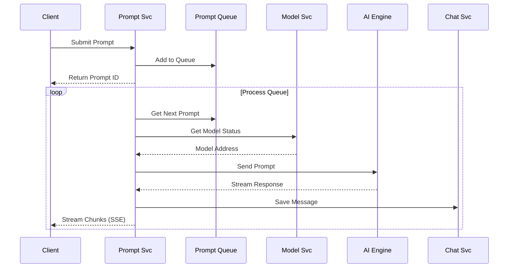

# Prompt Svc

The Prompt Svc is a resilient AI orchestration service that provides a unified interface for interacting with Large Language Models (LLMs) and other AI systems through a queue-based architecture with real-time streaming capabilities.

> This page provides a comprehensive overview of `Prompt Svc`. For detailed API information, refer to the [Prompt Svc API documentation](/docs/1backend-api/prompt).

## Architecture & Purpose

Prompt Svc serves as the **AI interaction layer** for 1Backend, providing:

- **Unified Interface**: Single API for all AI model interactions (text, image, audio)
- **Queue Management**: Resilient processing with automatic retries and exponential backoff
- **Real-Time Streaming**: Live response streaming via Server-Sent Events (SSE)
- **Multi-Modal Support**: Text-to-text, text-to-image, image-to-image, and more
- **Platform Abstraction**: Support for different AI engines (LlamaCpp, Stable Diffusion)
- **Integration Layer**: Seamless connection with Chat Svc and Model Svc

### Key Features

- **Asynchronous Processing**: Queue-based prompt handling with status tracking
- **Synchronous Mode**: Blocking calls for scripting and simple integrations
- **Streaming Responses**: Real-time output streaming for progressive results
- **Retry Logic**: Automatic retry with exponential backoff for failed prompts
- **Template System**: Flexible prompt templates for different model formats
- **Multi-Platform**: Engine-agnostic and engine-specific parameter support

## CLI Usage

Prompt Svc provides both synchronous and asynchronous interaction modes:

### Text Generation (Synchronous)

```bash
# Simple text generation with default model
oo post /prompt-svc/prompt \
  --prompt="Explain quantum computing in simple terms" \
  --sync=true

# With specific model
oo post /prompt-svc/prompt \
  --prompt="Write a Python function to calculate Fibonacci numbers" \
  --modelId="huggingface/TheBloke/codellama-7b.Q4_K_M.gguf" \
  --sync=true

# Using high-level parameters
oo post /prompt-svc/prompt \
  --prompt="Hello, how are you?" \
  --parameters.textToText.template="[INST] {prompt} [/INST]" \
  --sync=true

# Using engine-specific parameters  
oo post /prompt-svc/prompt \
  --prompt="What is the meaning of life?" \
  --engineParameters.llamaCpp.template="### HUMAN:\n{prompt}\n\n### RESPONSE:\n" \
  --sync=true
```

### Text Generation (Asynchronous with Streaming)

```bash
# Submit prompt to queue
oo post /prompt-svc/prompt \
  --prompt="Write a detailed essay about artificial intelligence" \
  --threadId="thread_12345" \
  --sync=false

# Subscribe to streaming responses (in another terminal)
curl -N -H "Authorization: Bearer $TOKEN" \
  "http://localhost:11337/prompt-svc/prompts/thread_12345/responses/subscribe"

# Or using Server-Sent Events in JavaScript
# const eventSource = new EventSource('/prompt-svc/prompts/thread_12345/responses/subscribe');
```

### Image Generation

```bash
# Text-to-image with Stable Diffusion
oo post /prompt-svc/prompt \
  --prompt="A serene mountain landscape at sunset, digital art" \
  --parameters.textToImage.width=512 \
  --parameters.textToImage.height=512 \
  --parameters.textToImage.steps=20 \
  --sync=true

# Using Stable Diffusion engine parameters
oo post /prompt-svc/prompt \
  --prompt="A futuristic city with flying cars" \
  --engineParameters.stableDiffusion.txt2Img.width=768 \
  --engineParameters.stableDiffusion.txt2Img.height=768 \
  --engineParameters.stableDiffusion.txt2Img.num_inference_steps=30 \
  --sync=true
```

### Advanced Configuration

```bash
# With retry configuration and thread management
oo post /prompt-svc/prompt \
  --prompt="Analyze this business case and provide recommendations" \
  --threadId="business_analysis_001" \
  --maxRetries=5 \
  --modelId="huggingface/TheBloke/mistral-7b-instruct-v0.2.Q4_K_M.gguf" \
  --sync=false

# Custom prompt ID (for idempotency)
oo post /prompt-svc/prompt \
  --id="prom_custom_12345" \
  --prompt="Generate a summary of the latest AI research" \
  --threadId="ai_research_summary" \
  --sync=true
```

### Prompt Management

```bash
# List active prompts
oo post /prompt-svc/prompts

# List prompts with specific status
oo post /prompt-svc/prompts \
  --query.filters='[{"field": "status", "operator": "equals", "value": "running"}]'

# Remove a prompt from queue
oo delete /prompt-svc/prompt/prom_12345

# List prompts for specific thread
oo post /prompt-svc/prompts \
  --query.filters='[{"field": "threadId", "operator": "equals", "value": "thread_12345"}]'
```

## Prompt Types & Capabilities

### Text Generation Types

```bash
# General text-to-text
Type: "Text-to-Text"
Use: General language tasks, conversations, analysis

# Question answering
Type: "Question Answering" 
Use: Specific questions with factual answers

# Translation
Type: "Translation"
Use: Language translation tasks

# Summarization
Type: "Summarization"
Use: Text summarization and condensation

# Text generation
Type: "Text Generation"
Use: Creative writing, code generation
```

### Image Generation Types

```bash
# Text-to-image
Type: "Text-to-Image"
Use: Generate images from text descriptions

# Image-to-image
Type: "Image-to-Image" 
Use: Transform existing images based on prompts

# Unconditional image generation
Type: "Unconditional Image Generation"
Use: Generate random images without prompts
```

### Multimodal Types

```bash
# Image-text-to-text
Type: "Image-Text-to-Text"
Use: Analyze images with text context

# Visual question answering
Type: "Visual Question Answering"
Use: Answer questions about images

# Document question answering
Type: "Document Question Answering"
Use: Extract information from document images
```

## Queue Architecture & Processing

### Queue Flow



### Queue Management

```bash
# Monitor queue status
oo post /prompt-svc/prompts \
  --query.filters='[{"field": "status", "operator": "in", "value": ["scheduled", "running"]}]'

# Check retry behavior
oo post /prompt-svc/prompts \
  --query.filters='[{"field": "status", "operator": "equals", "value": "errored"}]'

# Performance monitoring
oo post /prompt-svc/prompts \
  --query.orderBy='[{"field": "createdAt", "desc": true}]' \
  --query.limit=10
```

**Queue Status Values:**
- `scheduled`: Waiting in queue for processing
- `running`: Currently being processed by AI engine
- `completed`: Successfully finished
- `errored`: Failed but will be retried
- `abandoned`: Failed after max retries
- `canceled`: Manually canceled

### Retry Logic

Prompts that fail are automatically retried with exponential backoff:

```bash
# Configure retry behavior
oo post /prompt-svc/prompt \
  --prompt="Complex analysis task" \
  --maxRetries=5 \
  --sync=false

# Default retry strategy:
# Attempt 1: Immediate
# Attempt 2: 2 seconds delay  
# Attempt 3: 4 seconds delay
# Attempt 4: 8 seconds delay
# Attempt 5: 16 seconds delay
```

## Streaming & Real-Time Responses

### Server-Sent Events (SSE)

```bash
# Subscribe to thread streaming
curl -N -H "Authorization: Bearer $TOKEN" \
  "http://localhost:11337/prompt-svc/prompts/thread_12345/responses/subscribe"
```

**Stream Event Types:**
```json
// Progress chunk (partial response)
{
  "text": "Quantum computing is a revolutionary",
  "type": "progress"
}

// Done chunk (completion)
{
  "text": " technology that uses quantum mechanics.",
  "messageId": "msg_abc123",
  "type": "done"
}
```

### JavaScript Integration

```javascript
// Real-time streaming in web applications
const eventSource = new EventSource(
  '/prompt-svc/prompts/thread_12345/responses/subscribe',
  {
    headers: {
      'Authorization': 'Bearer ' + token
    }
  }
);

eventSource.onmessage = function(event) {
  const chunk = JSON.parse(event.data);
  
  if (chunk.type === 'progress') {
    // Append text to UI
    appendToOutput(chunk.text);
  } else if (chunk.type === 'done') {
    // Response complete
    finalizeOutput(chunk.messageId);
  }
};
```

### Stream Management

```bash
# Pre-subscribe to threads (before prompt submission)
curl -N -H "Authorization: Bearer $TOKEN" \
  "http://localhost:11337/prompt-svc/prompts/future_thread/responses/subscribe" &

# Then submit prompt to that thread
oo post /prompt-svc/prompt \
  --prompt="Generate a story" \
  --threadId="future_thread" \
  --sync=false
```

## Parameter Systems

### High-Level Parameters

Use these when you don't care about the specific AI engine:

```bash
# Text-to-text parameters
oo post /prompt-svc/prompt \
  --prompt="Hello world" \
  --parameters.textToText.template="[INST] {prompt} [/INST]"

# Text-to-image parameters
oo post /prompt-svc/prompt \
  --prompt="A beautiful sunset" \
  --parameters.textToImage.width=512 \
  --parameters.textToImage.height=512 \
  --parameters.textToImage.steps=20 \
  --parameters.textToImage.guidanceScale=7.5
```

### Engine-Specific Parameters

Use these for fine-tuned control over specific AI engines:

```bash
# LlamaCpp engine parameters
oo post /prompt-svc/prompt \
  --prompt="What is AI?" \
  --engineParameters.llamaCpp.template="### HUMAN:\n{prompt}\n\n### RESPONSE:\n"

# Stable Diffusion engine parameters
oo post /prompt-svc/prompt \
  --prompt="A spaceship" \
  --engineParameters.stableDiffusion.txt2Img.width=768 \
  --engineParameters.stableDiffusion.txt2Img.height=768 \
  --engineParameters.stableDiffusion.txt2Img.num_inference_steps=30 \
  --engineParameters.stableDiffusion.txt2Img.guidance_scale=8.0 \
  --engineParameters.stableDiffusion.txt2Img.negative_prompt="blurry, low quality"
```

## Real-World Usage Examples

### 1. Interactive Chatbot

```bash
# Start chat session
THREAD_ID="chat_session_$(date +%s)"

# Set up streaming in background
curl -N -H "Authorization: Bearer $TOKEN" \
  "http://localhost:11337/prompt-svc/prompts/$THREAD_ID/responses/subscribe" &

# Send messages
oo post /prompt-svc/prompt \
  --prompt="Hello! I need help with Python programming." \
  --threadId="$THREAD_ID" \
  --sync=false

oo post /prompt-svc/prompt \
  --prompt="How do I create a simple web server?" \
  --threadId="$THREAD_ID" \
  --sync=false
```

### 2. Code Generation Pipeline

```bash
# Use CodeLlama for programming tasks
CODE_MODEL="huggingface/TheBloke/codellama-7b.Q4_K_M.gguf"

# Generate function
oo post /prompt-svc/prompt \
  --prompt="Write a Python function that calculates the factorial of a number" \
  --modelId="$CODE_MODEL" \
  --sync=true

# Generate tests
oo post /prompt-svc/prompt \
  --prompt="Write unit tests for the factorial function above" \
  --modelId="$CODE_MODEL" \
  --threadId="code_generation_session" \
  --sync=true

# Generate documentation  
oo post /prompt-svc/prompt \
  --prompt="Write docstring documentation for the factorial function" \
  --modelId="$CODE_MODEL" \
  --threadId="code_generation_session" \
  --sync=true
```

### 3. Content Creation Workflow

```bash
# Research phase
oo post /prompt-svc/prompt \
  --prompt="Research the latest trends in renewable energy technology" \
  --threadId="content_creation_001" \
  --sync=false

# Writing phase
oo post /prompt-svc/prompt \
  --prompt="Write a 500-word article about solar panel efficiency improvements" \
  --threadId="content_creation_001" \
  --maxRetries=3 \
  --sync=false

# Image generation for article
oo post /prompt-svc/prompt \
  --prompt="Solar panels on a modern house roof, bright sunny day, professional photography" \
  --parameters.textToImage.width=1024 \
  --parameters.textToImage.height=768 \
  --threadId="content_creation_001" \
  --sync=false
```

### 4. Document Analysis System

```bash
# Analyze uploaded documents
ANALYSIS_THREAD="doc_analysis_$(date +%s)"

# Set up streaming for real-time results
curl -N -H "Authorization: Bearer $TOKEN" \
  "http://localhost:11337/prompt-svc/prompts/$ANALYSIS_THREAD/responses/subscribe" > analysis_output.txt &

# Submit analysis prompts
oo post /prompt-svc/prompt \
  --prompt="Summarize the key points in this financial report" \
  --threadId="$ANALYSIS_THREAD" \
  --sync=false

oo post /prompt-svc/prompt \
  --prompt="Extract all financial figures and create a table" \
  --threadId="$ANALYSIS_THREAD" \
  --sync=false

oo post /prompt-svc/prompt \
  --prompt="Identify potential risks mentioned in the document" \
  --threadId="$ANALYSIS_THREAD" \
  --sync=false
```

### 5. Creative AI Assistant

```bash
# Story generation with multiple prompts
STORY_THREAD="creative_story_$(date +%s)"

# Character development
oo post /prompt-svc/prompt \
  --prompt="Create a detailed character profile for a space explorer" \
  --threadId="$STORY_THREAD" \
  --sync=false

# Plot outline
oo post /prompt-svc/prompt \
  --prompt="Create a plot outline for a science fiction adventure" \
  --threadId="$STORY_THREAD" \
  --sync=false

# Generate artwork
oo post /prompt-svc/prompt \
  --prompt="Space explorer in futuristic suit standing on alien planet, concept art style" \
  --parameters.textToImage.width=768 \
  --parameters.textToImage.height=1024 \
  --threadId="$STORY_THREAD" \
  --sync=false
```

### 6. Batch Processing System

```bash
# Process multiple prompts with queue management
BATCH_THREAD="batch_processing_$(date +%s)"

# Submit batch of prompts
prompts=(
  "Analyze customer sentiment in this review: 'Great product, fast delivery'"
  "Translate to Spanish: 'Welcome to our customer support'"
  "Summarize: 'The quarterly earnings report shows...'"
  "Generate email template for customer onboarding"
)

for i in "${!prompts[@]}"; do
  oo post /prompt-svc/prompt \
    --id="batch_item_$i" \
    --prompt="${prompts[$i]}" \
    --threadId="$BATCH_THREAD" \
    --maxRetries=2 \
    --sync=false
  
  echo "Submitted batch item $i"
done

# Monitor batch progress
watch -n 5 "oo post /prompt-svc/prompts --query.filters='[{\"field\": \"threadId\", \"operator\": \"equals\", \"value\": \"$BATCH_THREAD\"}]' | jq '.prompts[] | {id, status}'"
```

## Integration Patterns

### Chat Svc Integration

Prompt Svc automatically integrates with [Chat Svc](/docs/built-in-services/chat-svc):

```bash
# Create chat thread
CHAT_THREAD=$(oo post /chat-svc/thread \
  --threadData.title="AI Assistant Chat" | jq -r '.thread.id')

# Send prompt (automatically creates chat messages)
oo post /prompt-svc/prompt \
  --prompt="Hello! Can you help me learn Python?" \
  --threadId="$CHAT_THREAD" \
  --sync=false

# View chat history
oo post /chat-svc/thread/$CHAT_THREAD/messages
```

### Model Svc Integration

Automatic model management and status checking:

```bash
# Check model status before prompting
oo get /model-svc/default-model/status

# Use specific model (Prompt Svc handles model communication)
oo post /prompt-svc/prompt \
  --prompt="Generate code documentation" \
  --modelId="huggingface/TheBloke/codellama-7b.Q4_K_M.gguf" \
  --sync=true

# Fallback to default model if modelId not specified
oo post /prompt-svc/prompt \
  --prompt="What's the weather like?" \
  --sync=true
```

### File Svc Integration

```bash
# Upload image for analysis
FILE_ID=$(curl -X PUT "http://localhost:11337/file-svc/upload" \
  -H "Authorization: Bearer $TOKEN" \
  -F "file=@./image.jpg" | jq -r '.upload.fileId')

# Analyze uploaded image (future feature)
oo post /prompt-svc/prompt \
  --prompt="Describe what you see in this image" \
  --fileIds='["'$FILE_ID'"]' \
  --sync=true
```

## Performance Optimization

### Synchronous vs Asynchronous

```bash
# Use sync=true for:
# - Simple scripts
# - Testing and development  
# - Short responses

oo post /prompt-svc/prompt \
  --prompt="What is 2+2?" \
  --sync=true

# Use sync=false for:
# - Long-running tasks
# - Web applications
# - Batch processing

oo post /prompt-svc/prompt \
  --prompt="Write a detailed research paper on quantum computing" \
  --threadId="research_paper_001" \
  --sync=false
```

### Queue Optimization

```bash
# Monitor queue depth
oo post /prompt-svc/prompts \
  --query.filters='[{"field": "status", "operator": "equals", "value": "scheduled"}]' \
  --query.count=true | jq '.count'

# Prioritize urgent prompts (submit to dedicated threads)
oo post /prompt-svc/prompt \
  --prompt="URGENT: System security analysis needed" \
  --threadId="priority_processing" \
  --sync=false

# Batch similar prompts for efficiency
BATCH_THREAD="text_analysis_batch"
for text in "text1" "text2" "text3"; do
  oo post /prompt-svc/prompt \
    --prompt="Analyze sentiment: $text" \
    --threadId="$BATCH_THREAD" \
    --sync=false
done
```

### Model Selection

```bash
# Use lightweight models for simple tasks
oo post /prompt-svc/prompt \
  --prompt="Hello, how are you?" \
  --modelId="huggingface/TheBloke/tinyllama-1.1b-chat-v1.0.Q4_K_S.gguf" \
  --sync=true

# Use powerful models for complex tasks
oo post /prompt-svc/prompt \
  --prompt="Analyze this complex business scenario and provide strategic recommendations" \
  --modelId="huggingface/TheBloke/mistral-7b-instruct-v0.2.Q5_K_M.gguf" \
  --sync=false
```

## Monitoring & Observability

### Queue Status Monitoring

```bash
# Real-time queue monitoring
monitor_queue() {
  while true; do
    echo "=== Queue Status $(date) ==="
    
    # Count by status
    for status in "scheduled" "running" "completed" "errored"; do
      count=$(oo post /prompt-svc/prompts \
        --query.filters='[{"field": "status", "operator": "equals", "value": "'$status'"}]' \
        --query.count=true | jq '.count')
      echo "$status: $count"
    done
    
    echo "---"
    sleep 10
  done
}

monitor_queue
```

### Performance Analytics

```bash
# Response time analysis
oo post /prompt-svc/prompts \
  --query.filters='[{"field": "status", "operator": "equals", "value": "completed"}]' \
  --query.orderBy='[{"field": "createdAt", "desc": true}]' \
  --query.limit=10 | jq '.prompts[] | {id, created: .createdAt, lastRun: .lastRun, runCount}'

# Error analysis
oo post /prompt-svc/prompts \
  --query.filters='[{"field": "status", "operator": "in", "value": ["errored", "abandoned"]}]' | \
  jq '.prompts[] | {id, error, runCount, status}'

# Thread activity
oo post /prompt-svc/prompts \
  --query.orderBy='[{"field": "createdAt", "desc": true}]' \
  --query.limit=20 | jq '.prompts | group_by(.threadId) | map({thread: .[0].threadId, count: length})'
```

### Health Checking

```bash
# Test basic functionality
test_prompt_health() {
  echo "Testing Prompt Svc health..."
  
  # Submit test prompt
  response=$(oo post /prompt-svc/prompt \
    --prompt="Test prompt for health check" \
    --sync=true)
  
  if echo "$response" | jq -e '.prompt.id' > /dev/null; then
    echo "✅ Prompt Svc is healthy"
  else
    echo "❌ Prompt Svc health check failed"
    echo "$response"
  fi
}

test_prompt_health
```

## Troubleshooting

### Common Issues

#### **Prompts Stuck in Queue**
```bash
# Check queue status
oo post /prompt-svc/prompts \
  --query.filters='[{"field": "status", "operator": "equals", "value": "scheduled"}]'

# Check model status
oo get /model-svc/default-model/status

# Restart processing by canceling and resubmitting
oo delete /prompt-svc/prompt/STUCK_PROMPT_ID
```

#### **Streaming Not Working**
```bash
# Test SSE connection
curl -v -N -H "Authorization: Bearer $TOKEN" \
  "http://localhost:11337/prompt-svc/prompts/test_thread/responses/subscribe"

# Check firewall/proxy settings
# Ensure Server-Sent Events are not blocked
```

#### **High Retry Counts**
```bash
# Identify problematic prompts
oo post /prompt-svc/prompts \
  --query.filters='[{"field": "runCount", "operator": "gt", "value": 3}]'

# Check model errors
oo post /prompt-svc/prompts \
  --query.filters='[{"field": "status", "operator": "equals", "value": "errored"}]' | \
  jq '.prompts[] | {id, error, runCount}'

# Verify model is responding
curl http://localhost:8001/health
```

#### **Memory/Performance Issues**
```bash
# Monitor queue depth
QUEUE_SIZE=$(oo post /prompt-svc/prompts \
  --query.filters='[{"field": "status", "operator": "in", "value": ["scheduled", "running"]}]' \
  --query.count=true | jq '.count')

echo "Queue depth: $QUEUE_SIZE"

# Clear completed prompts (if needed)
# Note: This is manual - no automated cleanup yet
```

### Debug Commands

```bash
# Detailed prompt inspection
debug_prompt() {
  local prompt_id=$1
  echo "=== Debug Prompt: $prompt_id ==="
  
  oo post /prompt-svc/prompts \
    --query.filters='[{"field": "id", "operator": "equals", "value": "'$prompt_id'"}]' | \
    jq '.prompts[0] | {
      id, status, prompt, threadId, modelId, 
      runCount, error, createdAt, lastRun
    }'
}

# Usage
debug_prompt "prom_12345"

# Stream testing
test_streaming() {
  local thread_id="test_stream_$(date +%s)"
  
  echo "Testing streaming for thread: $thread_id"
  
  # Start streaming in background
  curl -N -H "Authorization: Bearer $TOKEN" \
    "http://localhost:11337/prompt-svc/prompts/$thread_id/responses/subscribe" &
  
  local curl_pid=$!
  
  # Submit test prompt
  oo post /prompt-svc/prompt \
    --prompt="Count from 1 to 5" \
    --threadId="$thread_id" \
    --sync=false
  
  # Wait and cleanup
  sleep 10
  kill $curl_pid 2>/dev/null
}

test_streaming
```

## Template System

### Prompt Templates

Different models require different prompt formats:

```bash
# Mistral format
oo post /prompt-svc/prompt \
  --prompt="What is machine learning?" \
  --parameters.textToText.template="[INST] {prompt} [/INST]"

# Llama2 format  
oo post /prompt-svc/prompt \
  --prompt="Explain neural networks" \
  --parameters.textToText.template="### HUMAN:\n{prompt}\n\n### RESPONSE:\n"

# TinyLlama format
oo post /prompt-svc/prompt \
  --prompt="Hello world" \
  --parameters.textToText.template="<|system|>\nYou are a helpful assistant.</s>\n<|user|>\n{prompt}</s>\n<|assistant|>"

# Auto-detection (uses model's default template)
oo post /prompt-svc/prompt \
  --prompt="Default template test" \
  --modelId="huggingface/TheBloke/mistral-7b-instruct-v0.2.Q4_K_M.gguf"
```

### Template Variables

```bash
# Custom template with system message
oo post /prompt-svc/prompt \
  --prompt="Write code comments" \
  --parameters.textToText.template="<|system|>\nYou are a code documentation expert.</s>\n<|user|>\n{prompt}</s>\n<|assistant|>"

# Multi-variable templates (future feature)
# template: "Context: {context}\nQuestion: {prompt}\nAnswer:"
```

## API Reference Summary

| Endpoint | Method | Purpose |
|----------|---------|---------|
| `/prompt-svc/prompt` | POST | Submit prompt for processing |
| `/prompt-svc/prompts` | POST | List prompts with filtering |
| `/prompt-svc/prompt/{promptId}` | DELETE | Remove prompt from queue |
| `/prompt-svc/prompts/{threadId}/responses/subscribe` | GET | Subscribe to streaming responses |
| `/prompt-svc/types` | POST | Get type definitions (for API docs) |

## Permissions & Security

```bash
# Required permissions
prompt-svc:prompt:create    # Submit prompts
prompt-svc:prompt:view      # List and view prompts  
prompt-svc:prompt:stream    # Subscribe to streaming responses
prompt-svc:prompt:delete    # Remove prompts from queue

# Privacy protection
# Users can only see their own prompts (prompt text hidden for others)
```

## Related Services

- **[Model Svc](/docs/built-in-services/model-svc)**: AI model management and status
- **[Chat Svc](/docs/built-in-services/chat-svc)**: Conversation threading and message storage
- **[File Svc](/docs/built-in-services/file-svc)**: File attachments and image inputs (future)
- **[Policy Svc](/docs/built-in-services/policy-svc)**: Rate limiting AI usage

## Future Enhancements

### Planned Features
- **Multi-Model Orchestration**: Automatic model selection based on prompt type
- **Model Auto-Scaling**: Start/stop models based on queue depth
- **File Input Support**: Image/document analysis with file uploads
- **Prompt Chaining**: Connect multiple prompts in workflows
- **Custom Templates**: User-defined prompt templates

### Integration Roadmap
- **Voice Integration**: Audio-to-text and text-to-speech capabilities
- **Visual Processing**: Advanced image analysis and generation
- **Workflow Engine**: Complex multi-step AI workflows
- **A/B Testing**: Compare different models/prompts for same task
- **Analytics Dashboard**: Detailed usage and performance metrics

Prompt Svc provides the essential AI interaction layer for 1Backend, enabling everything from simple chatbots to complex AI workflows with real-time streaming and robust queue management.
