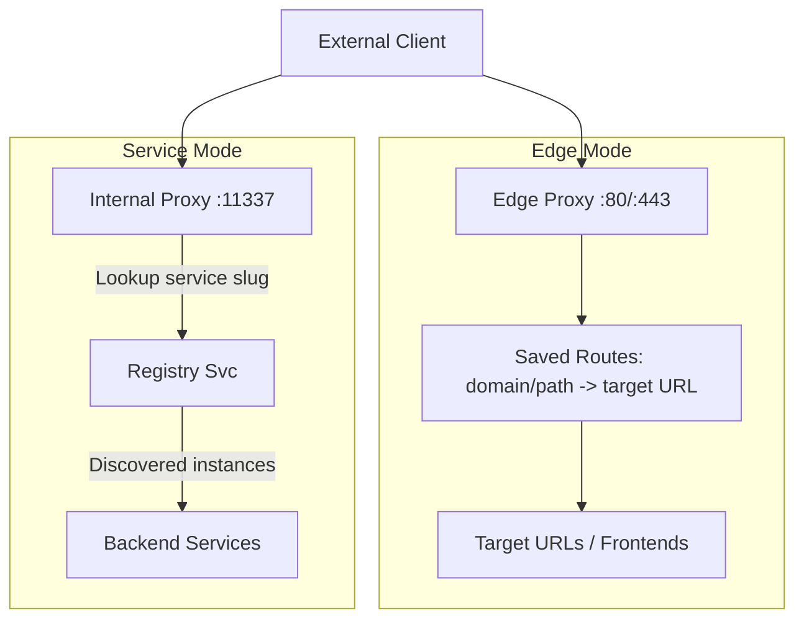
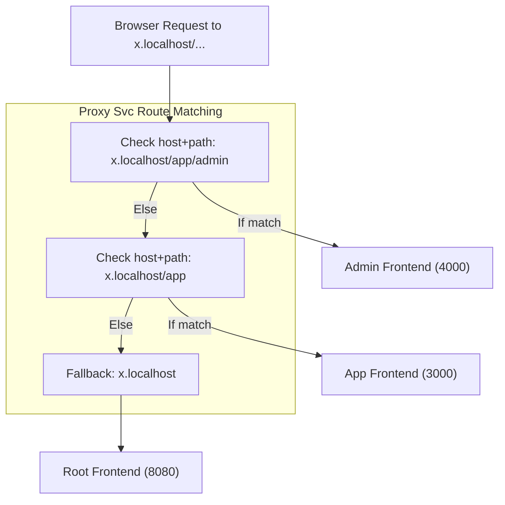
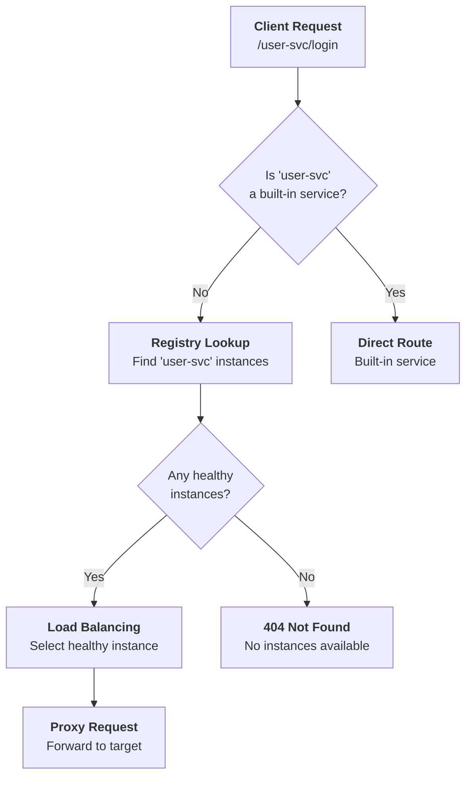
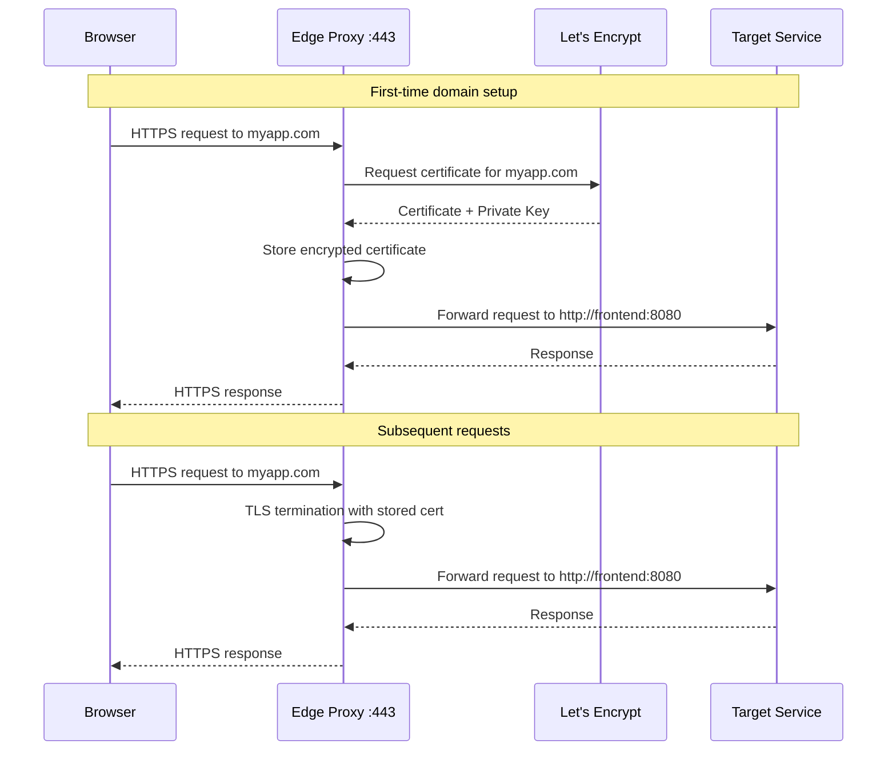

# Proxy Svc

The Proxy Svc is a sophisticated reverse proxy and load balancer that handles both internal service routing and edge traffic management with automatic HTTPS certificate provisioning.

> This page provides a comprehensive overview of `Proxy Svc`. For detailed API information, refer to the [Proxy Svc API documentation](/docs/1backend-api/list-routes).

## Architecture & Purpose

Proxy Svc serves as the **traffic management layer** for 1Backend, providing:

- **Service Proxying**: Routes requests to custom services registered in the Registry Svc
- **Edge Proxying**: Handles external HTTPS traffic with automatic TLS termination
- **Load Balancing**: Intelligent distribution with health-aware routing
- **Certificate Management**: Automatic Let's Encrypt certificate provisioning and renewal
- **Multi-Tenant Routing**: Domain-based routing for multiple applications

### Dual Operation Modes



## Microfrontends by Path

Proxy Svc supports hosting **multiple frontends under a single domain** by using path-prefix routes. This makes it easy to run a microfrontend architecture without extra gateways.

### Example Routes

- id: "x.localhost"  
  target: "http://root-frontend:8080"

- id: "x.localhost/app"  
  target: "http://app-frontend:3000"

- id: "x.localhost/app/admin"  
  target: "http://admin-frontend:4000"

### How Lookup Works

When a request comes in, Proxy Svc tries the **longest matching prefix**:

1. `/app/admin/settings` → matches `x.localhost/app/admin`  
   → goes to `http://admin-frontend:4000/app/admin/settings`

2. `/app/page` → matches `x.localhost/app`  
   → goes to `http://app-frontend:3000/app/page`

3. `/` or anything else → falls back to `x.localhost`  
   → goes to `http://root-frontend:8080/`

### Visual Flow



Benefits:

- Multiple independent frontends can live under one domain
- Deepest path prefix always takes precedence, ensuring /app/admin resolves correctly
- Easy to extend: just add more host+path routes

## CLI Usage

### Route Management

```bash
# List all configured routes
oo routes list

# Save routes from YAML file
oo routes save routes.yaml

# Save routes from directory (processes all .yaml files)
oo routes save ./config/routes/
```

### Route Configuration Files

#### Single Route YAML

```yaml
# api-route.yaml
id: "api.example.com"
target: "http://1backend:11337"
```

#### Multiple Routes YAML

```yaml
# routes.yaml
- id: "api.example.com"
  target: "http://1backend:11337"
- id: "example.com"
  target: "http://frontend:8080"
- id: "cdn.example.com"
  target: "http://nginx:80"
- id: "app.example.com"
  target: "http://react-app:3000"
```

## Service Proxying (Internal Routing)

### How Service Routing Works

When you send a request to 1Backend:

```bash
curl http://127.0.0.1:11337/user-svc/login
```

The routing decision follows this flow:



### Edge Proxy Flow



### Automatic HTTPS Certificates

The edge proxy automatically handles:

- **Certificate Provisioning**: Requests certificates from Let's Encrypt
- **Challenge Handling**: Responds to ACME HTTP-01 challenges on port 80
- **TLS Termination**: Handles SSL/TLS encryption/decryption
- **Certificate Renewal**: Automatically renews certificates before expiry
- **Certificate Storage**: Encrypted storage in the database

```bash
crufter@cruftop:~/1backend$ oo certs ls
CERT ID                     CREATED AT   UPDATED AT            COMMON NAME                 ISSUER   NOT BEFORE   NOT AFTER    SERIAL
singulatron.com             2025-06-08   2025-08-09 14:22:44   singulatron.com             E6       2025-08-09   2025-11-07   34394815…
api.singulatron.com         2025-06-08   2025-08-09 14:15:47   api.singulatron.com         E5       2025-08-09   2025-11-07   83840157…
acme_account+key            2025-06-08   2025-06-08 14:12:42

```
