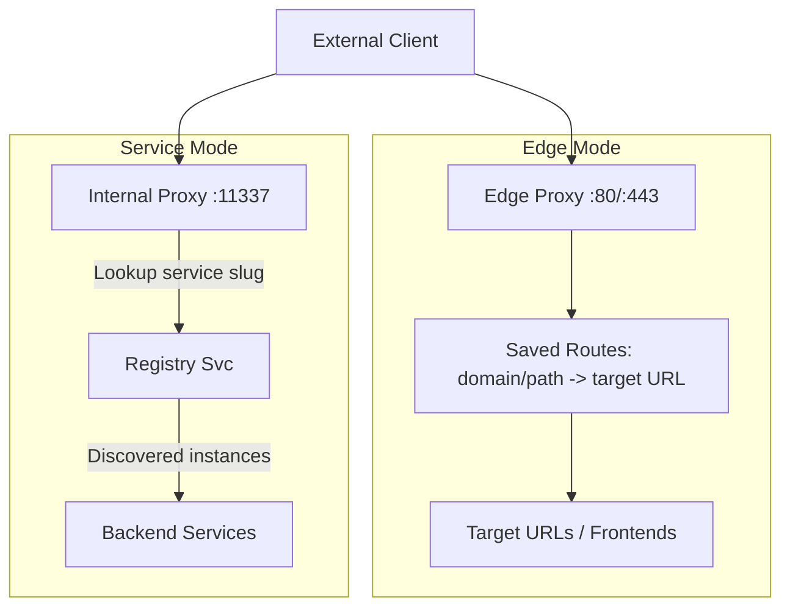
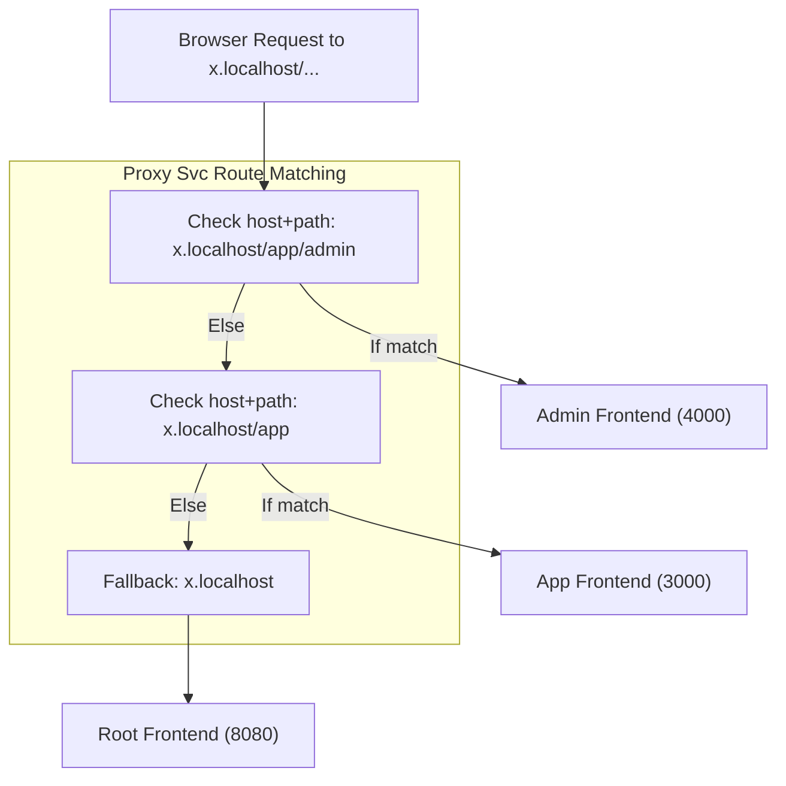
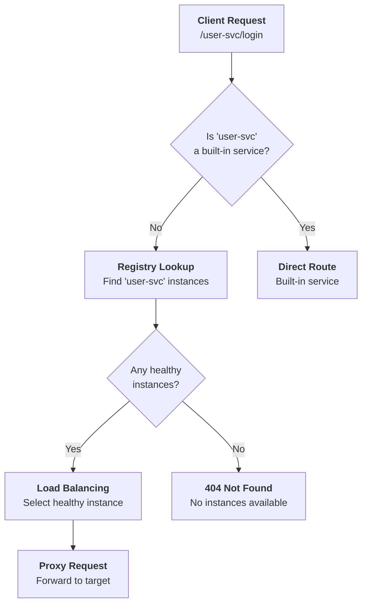
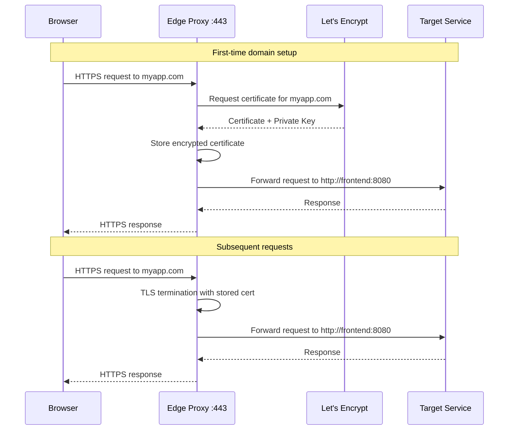

# Proxy Svc

The Proxy Svc is a sophisticated reverse proxy and load balancer that handles both internal service routing and edge traffic management with automatic HTTPS certificate provisioning.

> This page provides a comprehensive overview of `Proxy Svc`. For detailed API information, refer to the [Proxy Svc API documentation](/docs/1backend-api/list-routes).

## Architecture & Purpose

Proxy Svc serves as the **traffic management layer** for 1Backend, providing:

- **Service Proxying**: Routes requests to custom services registered in the Registry Svc
- **Edge Proxying**: Handles external HTTPS traffic with automatic TLS termination
- **Load Balancing**: Intelligent distribution with health-aware routing
- **Certificate Management**: Automatic Let's Encrypt certificate provisioning and renewal
- **Multi-Tenant Routing**: Domain-based routing for multiple applications

### Dual Operation Modes



## Microfrontends by Path

Proxy Svc supports hosting **multiple frontends under a single domain** by using path-prefix routes. This makes it easy to run a microfrontend architecture without extra gateways.

### Example Routes

- id: "x.localhost"  
  target: "http://root-frontend:8080"

- id: "x.localhost/app"  
  target: "http://app-frontend:3000"

- id: "x.localhost/app/admin"  
  target: "http://admin-frontend:4000"

### How Lookup Works

When a request comes in, Proxy Svc tries the **longest matching prefix**:

1. `/app/admin/settings` → matches `x.localhost/app/admin`  
   → goes to `http://admin-frontend:4000/app/admin/settings`

2. `/app/page` → matches `x.localhost/app`  
   → goes to `http://app-frontend:3000/app/page`

3. `/` or anything else → falls back to `x.localhost`  
   → goes to `http://root-frontend:8080/`

### Visual Flow



Benefits:

- Multiple independent frontends can live under one domain
- Deepest path prefix always takes precedence, ensuring /app/admin resolves correctly
- Easy to extend: just add more host+path routes

## CLI Usage

### Route Management

```bash
# List all configured routes
oo routes list
oo routes ls
oo r ls

# Save routes from YAML file
oo routes save routes.yaml
oo r s routes.yaml

# Save routes from directory (processes all .yaml files)
oo routes save ./config/routes/
```

### Route Configuration Files

#### Single Route YAML

```yaml
# api-route.yaml
id: "api.example.com"
target: "http://1backend:11337"
```

#### Multiple Routes YAML

```yaml
# routes.yaml
- id: "api.example.com"
  target: "http://1backend:11337"
- id: "example.com"
  target: "http://frontend:8080"
- id: "cdn.example.com"
  target: "http://nginx:80"
- id: "app.example.com"
  target: "http://react-app:3000"
```

### Route Management Examples

```bash
# Development setup
cat > dev-routes.yaml << EOF
- id: "api.localhost"
  target: "http://localhost:11337"
- id: "app.localhost"
  target: "http://localhost:3000"
- id: "admin.localhost"
  target: "http://localhost:8080"
EOF

oo routes save dev-routes.yaml

# Production setup
cat > prod-routes.yaml << EOF
- id: "api.mycompany.com"
  target: "http://1backend:11337"
- id: "mycompany.com"
  target: "http://frontend:8080"
- id: "cdn.mycompany.com"
  target: "http://cdn-server:80"
- id: "admin.mycompany.com"
  target: "http://admin-panel:3000"
EOF

oo routes save prod-routes.yaml

# Staging environment
cat > staging-routes.yaml << EOF
- id: "staging-api.mycompany.com"
  target: "http://staging-backend:11337"
- id: "staging.mycompany.com"
  target: "http://staging-frontend:8080"
EOF

oo routes save staging-routes.yaml
```

### HTTP API Usage

```bash
# List routes via API
oo post /proxy-svc/routes

# Save routes via API
oo put /proxy-svc/routes \
  --routes='[
    {"id": "api.example.com", "target": "http://1backend:11337"},
    {"id": "example.com", "target": "http://frontend:8080"}
  ]'

# List certificates
oo post /proxy-svc/certs

# Filter routes by IDs
oo post /proxy-svc/routes \
  --ids='["api.example.com", "example.com"]'

# Filter certificates by domain
oo post /proxy-svc/certs \
  --ids='["example.com", "api.example.com"]'
```

## Service Proxying (Internal Routing)

### How Service Routing Works

When you send a request to 1Backend:

```bash
curl http://127.0.0.1:11337/user-svc/login
```

The routing decision follows this flow:



### Service Discovery Integration

```bash
# Register a service instance (prerequisite for proxying)
oo post /registry-svc/instances/register \
  --slug="user-svc" \
  --url="http://user-service:8080"

# Test service proxying
curl http://localhost:11337/user-svc/health
# This gets proxied to: http://user-service:8080/user-svc/health

# Check instance health status
oo post /registry-svc/instances \
  --slug="user-svc"
```

### Load Balancing & Health Checking

```bash
# Multiple instances for load balancing
oo post /registry-svc/instances/register \
  --slug="api-svc" \
  --url="http://api-server-1:8080"

oo post /registry-svc/instances/register \
  --slug="api-svc" \
  --url="http://api-server-2:8080"

oo post /registry-svc/instances/register \
  --slug="api-svc" \
  --url="http://api-server-3:8080"

# Proxy Svc will:
# 1. Prioritize healthy instances
# 2. Fall back to any available instances
# 3. Randomly distribute load
# 4. Return 404 if no instances exist
```

### Service Routing Examples

```bash
# E-commerce microservices
oo post /registry-svc/instances/register --slug="product-svc" --url="http://product-service:8080"
oo post /registry-svc/instances/register --slug="cart-svc" --url="http://cart-service:8080"
oo post /registry-svc/instances/register --slug="payment-svc" --url="http://payment-service:8080"

# Client requests get automatically routed:
curl http://localhost:11337/product-svc/catalog
curl http://localhost:11337/cart-svc/add-item
curl http://localhost:11337/payment-svc/process

# Multi-instance services for high availability
oo post /registry-svc/instances/register --slug="auth-svc" --url="http://auth-1:8080"
oo post /registry-svc/instances/register --slug="auth-svc" --url="http://auth-2:8080"
oo post /registry-svc/instances/register --slug="auth-svc" --url="http://auth-3:8080"

# Requests to /auth-svc/* get load balanced across all 3 instances
```

## Edge Proxying (External Traffic)

### Enabling Edge Proxy

```bash
# Enable edge proxy mode
export OB_EDGE_PROXY=true

# The proxy will now listen on:
# Port 80 (HTTP) - for ACME challenges and HTTP redirects
# Port 443 (HTTPS) - for secure traffic with automatic TLS termination
```

### Domain-Based Routing

```bash
# Configure production domain routing
cat > production-routes.yaml << EOF
- id: "myapp.com"
  target: "http://frontend:8080"
- id: "api.myapp.com"
  target: "http://1backend:11337"
- id: "admin.myapp.com"
  target: "http://admin-dashboard:3000"
- id: "docs.myapp.com"
  target: "http://documentation:4000"
EOF

oo routes save production-routes.yaml
```

### Edge Proxy Flow



### Automatic HTTPS Certificates

The edge proxy automatically handles:

- **Certificate Provisioning**: Requests certificates from Let's Encrypt
- **Challenge Handling**: Responds to ACME HTTP-01 challenges on port 80
- **TLS Termination**: Handles SSL/TLS encryption/decryption
- **Certificate Renewal**: Automatically renews certificates before expiry
- **Certificate Storage**: Encrypted storage in the database

```bash
# Check certificate status
oo post /proxy-svc/certs

# View certificate details for a domain
oo post /proxy-svc/certs \
  --ids='["myapp.com"]'

# Sample certificate response:
{
  "certs": [
    {
      "id": "myapp.com",
      "commonName": "myapp.com",
      "dnsNames": ["myapp.com"],
      "issuer": "Let's Encrypt",
      "notBefore": "2024-01-01T00:00:00Z",
      "notAfter": "2024-04-01T00:00:00Z",
      "signatureAlgorithm": "SHA256-RSA",
      "publicKeyAlgorithm": "RSA",
      "publicKeyBitLength": 2048
    }
  ]
}
```

### Certificate File Sync

```bash
# Enable certificate file synchronization
export OB_SYNC_CERTS_TO_FILES=true

# Certificates will be written to:
# ~/.1backend/certs/live/myapp.com/cert.pem
# ~/.1backend/certs/live/myapp.com/privkey.pem
# ~/.1backend/certs/live/myapp.com/chain.pem
# ~/.1backend/certs/live/myapp.com/fullchain.pem

# This enables integration with external tools like nginx
```

## Real-World Configuration Examples

### 1. Single Application Deployment

```yaml
# simple-app.yaml
- id: "myapp.com"
  target: "http://frontend:8080"
- id: "api.myapp.com"
  target: "http://1backend:11337"
```

```bash
# DNS Configuration
# A record: myapp.com -> YOUR_SERVER_IP
# A record: api.myapp.com -> YOUR_SERVER_IP

oo routes save simple-app.yaml

# Test the setup
curl https://myapp.com
curl https://api.myapp.com/user-svc/health
```

### 2. Multi-Tenant SaaS Platform

```yaml
# saas-platform.yaml
- id: "myplatform.com"
  target: "http://marketing-site:8080"
- id: "app.myplatform.com"
  target: "http://app-frontend:3000"
- id: "api.myplatform.com"
  target: "http://1backend:11337"
- id: "admin.myplatform.com"
  target: "http://admin-panel:4000"
- id: "docs.myplatform.com"
  target: "http://documentation:5000"
- id: "status.myplatform.com"
  target: "http://status-page:6000"
```

### 3. Microservices Architecture

```yaml
# microservices.yaml
- id: "gateway.company.com"
  target: "http://1backend:11337"
- id: "web.company.com"
  target: "http://web-app:8080"
- id: "mobile-api.company.com"
  target: "http://mobile-backend:9000"
- id: "analytics.company.com"
  target: "http://analytics-dashboard:7000"
- id: "monitoring.company.com"
  target: "http://grafana:3000"
```

### 4. Development Environment

```yaml
# dev-environment.yaml
- id: "api.dev.company.com"
  target: "http://localhost:11337"
- id: "app.dev.company.com"
  target: "http://localhost:3000"
- id: "admin.dev.company.com"
  target: "http://localhost:8080"
- id: "docs.dev.company.com"
  target: "http://localhost:4000"
```

### 5. Staging & Production Split

```bash
# Staging routes
cat > staging.yaml << EOF
- id: "staging-api.company.com"
  target: "http://staging-backend:11337"
- id: "staging.company.com"
  target: "http://staging-frontend:8080"
EOF

# Production routes
cat > production.yaml << EOF
- id: "api.company.com"
  target: "http://prod-backend:11337"
- id: "company.com"
  target: "http://prod-frontend:8080"
- id: "www.company.com"
  target: "http://prod-frontend:8080"
EOF

oo routes save staging.yaml
oo routes save production.yaml
```

## Advanced Configuration

### Custom Service Registration with Proxy

```bash
# Register custom services for proxying
register_service() {
  local service_name=$1
  local service_url=$2

  oo post /registry-svc/instances/register \
    --slug="$service_name" \
    --url="$service_url" \
    --metadata.version="1.0.0" \
    --metadata.environment="production"
}

# Register multiple services
register_service "user-svc" "http://user-service:8080"
register_service "product-svc" "http://product-service:8080"
register_service "order-svc" "http://order-service:8080"
register_service "notification-svc" "http://notification-service:8080"

# These services become available at:
# http://localhost:11337/user-svc/*
# http://localhost:11337/product-svc/*
# http://localhost:11337/order-svc/*
# http://localhost:11337/notification-svc/*
```

### Health Check Integration

```bash
# Check service health before routing
health_check() {
  local service_url=$1
  curl -f "$service_url/health" > /dev/null 2>&1
}

# Automated health checking script
monitor_services() {
  services=(
    "user-svc:http://user-service:8080"
    "product-svc:http://product-service:8080"
    "order-svc:http://order-service:8080"
  )

  for service in "${services[@]}"; do
    IFS=':' read -r name url <<< "$service"

    if health_check "$url"; then
      echo "✅ $name is healthy"
    else
      echo "❌ $name is unhealthy"
      # Optionally remove unhealthy instance
      # oo delete /registry-svc/instances/$instance_id
    fi
  done
}

# Run health checks
monitor_services
```

### Load Balancing Strategies

```bash
# Round-robin load balancing with multiple instances
setup_load_balanced_service() {
  local service_name=$1
  shift
  local instances=("$@")

  for instance in "${instances[@]}"; do
    oo post /registry-svc/instances/register \
      --slug="$service_name" \
      --url="$instance"
  done
}

# Setup load balanced API service
setup_load_balanced_service "api-svc" \
  "http://api-1:8080" \
  "http://api-2:8080" \
  "http://api-3:8080"

# Proxy Svc will automatically:
# 1. Prefer healthy instances
# 2. Randomly distribute requests
# 3. Handle instance failures gracefully
```

### SSL/TLS Configuration

```bash
# Manual certificate installation (for custom CAs)
install_custom_cert() {
  local domain=$1
  local cert_file=$2

  # Note: This endpoint is primarily for testing
  # Production certificates should be managed automatically
  oo put /proxy-svc/certs \
    --certs='[{
      "id": "'$domain'",
      "cert": "'$(base64 -w 0 < $cert_file)'"
    }]'
}

# Check certificate expiration
check_cert_expiry() {
  local domain=$1
  echo | openssl s_client -servername $domain -connect $domain:443 2>/dev/null | \
    openssl x509 -noout -dates
}

# Monitor certificate expiration
for domain in myapp.com api.myapp.com admin.myapp.com; do
  echo "Certificate expiry for $domain:"
  check_cert_expiry $domain
done
```

## Monitoring & Observability

### Route Health Monitoring

```bash
# Monitor edge proxy routes
monitor_edge_routes() {
  while true; do
    echo "=== Edge Route Health Check $(date) ==="

    oo post /proxy-svc/routes | jq -r '.routes[] | "\(.id) -> \(.target)"' | \
    while IFS=' -> ' read -r domain target; do
      # Check HTTPS accessibility
      if curl -fsSL --max-time 5 "https://$domain" > /dev/null 2>&1; then
        echo "✅ $domain (https)"
      else
        echo "❌ $domain (https) - checking http..."
        if curl -fsSL --max-time 5 "http://$domain" > /dev/null 2>&1; then
          echo "⚠️  $domain (http only)"
        else
          echo "❌ $domain (unreachable)"
        fi
      fi

      # Check target availability
      if curl -fsSL --max-time 5 "$target" > /dev/null 2>&1; then
        echo "✅ Target: $target"
      else
        echo "❌ Target: $target (unreachable)"
      fi

      echo "---"
    done

    sleep 30
  done
}

monitor_edge_routes
```

### Service Proxy Monitoring

```bash
# Monitor service proxy health
monitor_service_routes() {
  echo "=== Service Route Health Check $(date) ==="

  # Get all registered services
  oo post /registry-svc/instances | jq -r '.instances[] | "\(.slug) -> \(.url)"' | \
  while IFS=' -> ' read -r slug url; do
    # Test proxy routing
    proxy_url="http://localhost:11337/$slug/health"

    if curl -fsSL --max-time 5 "$proxy_url" > /dev/null 2>&1; then
      echo "✅ Proxy: $slug (via 1Backend)"
    else
      echo "❌ Proxy: $slug (proxy failed)"
    fi

    # Test direct access
    if curl -fsSL --max-time 5 "$url/health" > /dev/null 2>&1; then
      echo "✅ Direct: $url"
    else
      echo "❌ Direct: $url (unreachable)"
    fi

    echo "---"
  done
}

monitor_service_routes
```

### Certificate Monitoring

```bash
# Monitor certificate status
monitor_certificates() {
  echo "=== Certificate Status $(date) ==="

  oo post /proxy-svc/certs | jq -r '.certs[] | "\(.id) \(.notAfter) \(.issuer)"' | \
  while read -r domain expiry issuer; do
    # Calculate days until expiry
    expiry_epoch=$(date -d "$expiry" +%s)
    current_epoch=$(date +%s)
    days_left=$(( (expiry_epoch - current_epoch) / 86400 ))

    if [ $days_left -gt 30 ]; then
      status="✅"
    elif [ $days_left -gt 7 ]; then
      status="⚠️ "
    else
      status="❌"
    fi

    echo "$status $domain - $days_left days left ($issuer)"
  done
}

monitor_certificates
```

### Performance Analytics

```bash
# Proxy performance testing
test_proxy_performance() {
  local target_url=$1
  local num_requests=${2:-100}

  echo "Testing proxy performance: $target_url"

  # Direct target test
  echo "Direct target performance:"
  curl -w "@curl-format.txt" -o /dev/null -s "$target_url"

  # Proxy performance test
  echo "Proxy performance:"
  proxy_url="http://localhost:11337/$(basename $target_url)"
  curl -w "@curl-format.txt" -o /dev/null -s "$proxy_url"

  # Concurrent test
  echo "Concurrent test ($num_requests requests):"
  time for i in $(seq 1 $num_requests); do
    curl -s "$proxy_url" > /dev/null &
  done
  wait
}

# Create curl format file
cat > curl-format.txt << 'EOF'
     time_namelookup:  %{time_namelookup}\n
        time_connect:  %{time_connect}\n
     time_appconnect:  %{time_appconnect}\n
    time_pretransfer:  %{time_pretransfer}\n
       time_redirect:  %{time_redirect}\n
  time_starttransfer:  %{time_starttransfer}\n
                     ----------\n
          time_total:  %{time_total}\n
EOF

# Run performance tests
test_proxy_performance "http://frontend:8080"
test_proxy_performance "http://api-service:8080"
```

## Troubleshooting

### Common Issues

#### **Routes Not Working**

```bash
# Check if routes are properly configured
oo routes list

# Verify route exists for your domain
oo post /proxy-svc/routes \
  --ids='["your-domain.com"]'

# Test if target is reachable
curl -v http://your-target-service:8080

# Check DNS configuration
nslookup your-domain.com
dig your-domain.com A

# Test HTTPS certificate
curl -vI https://your-domain.com
```

#### **Certificate Issues**

```bash
# Check certificate status
oo post /proxy-svc/certs \
  --ids='["your-domain.com"]'

# Test certificate chain
echo | openssl s_client -servername your-domain.com -connect your-domain.com:443

# Check Let's Encrypt rate limits
curl "https://crt.sh/?q=your-domain.com&output=json" | jq length

# Manually trigger certificate request (restart service)
docker restart 1backend-container
```

#### **Service Proxy Issues**

```bash
# Check if service is registered
oo post /registry-svc/instances \
  --slug="your-service"

# Verify service health
curl http://your-service:8080/health

# Test direct proxy call
curl -v http://localhost:11337/your-service/health

# Check service logs
docker logs your-service-container
```

#### **Load Balancing Problems**

```bash
# Check all instances for a service
oo post /registry-svc/instances \
  --slug="your-service"

# Test each instance individually
for url in $(oo post /registry-svc/instances --slug="your-service" | jq -r '.instances[].url'); do
  echo "Testing: $url"
  curl -f "$url/health" && echo "✅ Healthy" || echo "❌ Unhealthy"
done

# Check proxy logs for routing decisions
docker logs 1backend-proxy
```

### Debug Commands

```bash
# Comprehensive proxy debug
debug_proxy() {
  echo "=== Proxy Service Debug ==="

  echo "1. Routes Configuration:"
  oo routes list

  echo "2. Certificate Status:"
  oo post /proxy-svc/certs

  echo "3. Service Instances:"
  oo post /registry-svc/instances

  echo "4. Service Health Check:"
  for service in $(oo post /registry-svc/instances | jq -r '.instances[].slug' | sort -u); do
    echo "Testing service: $service"
    curl -f "http://localhost:11337/$service/health" && echo "✅" || echo "❌"
  done

  echo "5. Edge Proxy Test:"
  if [ "$OB_EDGE_PROXY" = "true" ]; then
    echo "Edge proxy is enabled"
    for domain in $(oo routes list | tail -n +2 | awk '{print $1}'); do
      echo "Testing domain: $domain"
      curl -f "https://$domain" > /dev/null && echo "✅" || echo "❌"
    done
  else
    echo "Edge proxy is disabled"
  fi
}

debug_proxy

# Network connectivity test
test_connectivity() {
  local target=$1
  echo "Testing connectivity to: $target"

  # Extract host and port
  if [[ $target =~ ^https?://([^:/]+)(:([0-9]+))?.*$ ]]; then
    host=${BASH_REMATCH[1]}
    port=${BASH_REMATCH[3]:-$(echo $target | grep -q ^https && echo 443 || echo 80)}
  else
    echo "Invalid URL format"
    return 1
  fi

  # Test DNS resolution
  echo "DNS resolution:"
  nslookup $host || echo "DNS resolution failed"

  # Test port connectivity
  echo "Port connectivity:"
  nc -zv $host $port || echo "Port $port is not reachable"

  # Test HTTP response
  echo "HTTP response:"
  curl -I --max-time 10 $target || echo "HTTP request failed"
}

# Usage
test_connectivity "http://frontend:8080"
test_connectivity "https://api.example.com"
```

### Performance Debugging

```bash
# Proxy latency analysis
analyze_proxy_latency() {
  local service=$1
  local iterations=${2:-10}

  echo "Analyzing proxy latency for: $service"

  # Direct service call
  echo "Direct service latency:"
  for i in $(seq 1 $iterations); do
    direct_time=$(curl -w "%{time_total}" -o /dev/null -s "http://$service:8080/health" 2>/dev/null || echo "0")
    echo "Iteration $i: ${direct_time}s"
  done

  # Proxy call
  echo "Proxy service latency:"
  for i in $(seq 1 $iterations); do
    proxy_time=$(curl -w "%{time_total}" -o /dev/null -s "http://localhost:11337/${service}-svc/health" 2>/dev/null || echo "0")
    echo "Iteration $i: ${proxy_time}s"
  done
}

# Usage
analyze_proxy_latency "user-service" 5

# Load testing
load_test_proxy() {
  local endpoint=$1
  local concurrent=${2:-10}
  local requests=${3:-100}

  echo "Load testing: $endpoint"
  echo "Concurrent users: $concurrent"
  echo "Total requests: $requests"

  # Using curl for simple load test
  for i in $(seq 1 $concurrent); do
    (
      for j in $(seq 1 $((requests / concurrent))); do
        curl -s "$endpoint" > /dev/null
      done
    ) &
  done

  wait
  echo "Load test completed"
}

# Usage
load_test_proxy "http://localhost:11337/user-svc/health" 5 50
```

## Configuration Examples

### Docker Compose Integration

```yaml
# docker-compose.yml
version: "3.8"
services:
  1backend:
    image: 1backend/1backend:latest
    ports:
      - "11337:11337"
      - "80:80"
      - "443:443"
    environment:
      - OB_EDGE_PROXY=true
      - OB_SYNC_CERTS_TO_FILES=true
    volumes:
      - ./certs:/root/.1backend/certs
      - ./routes:/app/routes

  frontend:
    image: nginx:alpine
    ports:
      - "8080:80"

  api-service:
    image: my-api:latest
    ports:
      - "8081:8080"
```

### Kubernetes Deployment

```yaml
# proxy-config.yaml
apiVersion: v1
kind: ConfigMap
metadata:
  name: proxy-routes
data:
  routes.yaml: |
    - id: "api.myapp.com"
      target: "http://1backend-service:11337"
    - id: "myapp.com"
      target: "http://frontend-service:80"
---
apiVersion: apps/v1
kind: Deployment
metadata:
  name: 1backend-proxy
spec:
  replicas: 1
  selector:
    matchLabels:
      app: 1backend-proxy
  template:
    metadata:
      labels:
        app: 1backend-proxy
    spec:
      containers:
        - name: proxy
          image: 1backend/1backend:latest
          ports:
            - containerPort: 11337
            - containerPort: 80
            - containerPort: 443
          env:
            - name: OB_EDGE_PROXY
              value: "true"
          volumeMounts:
            - name: routes
              mountPath: /app/routes
      volumes:
        - name: routes
          configMap:
            name: proxy-routes
```

### Nginx Integration

```nginx
# nginx.conf (when using certificate file sync)
server {
    listen 443 ssl;
    server_name myapp.com;

    ssl_certificate /path/to/.1backend/certs/live/myapp.com/fullchain.pem;
    ssl_certificate_key /path/to/.1backend/certs/live/myapp.com/privkey.pem;

    location / {
        proxy_pass http://frontend:8080;
        proxy_set_header Host $host;
        proxy_set_header X-Real-IP $remote_addr;
        proxy_set_header X-Forwarded-For $proxy_add_x_forwarded_for;
        proxy_set_header X-Forwarded-Proto $scheme;
    }
}
```

## API Reference Summary

| Endpoint            | Method | Purpose                          |
| ------------------- | ------ | -------------------------------- |
| `/proxy-svc/routes` | POST   | List configured routes           |
| `/proxy-svc/routes` | PUT    | Save/update routes               |
| `/proxy-svc/certs`  | POST   | List SSL certificates            |
| `/proxy-svc/certs`  | PUT    | Save certificates (testing only) |

## Permissions & Security

```bash
# Required permissions
proxy-svc:route:view    # List routes
proxy-svc:route:edit    # Save/update routes
proxy-svc:cert:view     # List certificates
proxy-svc:cert:edit     # Save certificates (admin only)

# Security features
# - Encrypted certificate storage
# - Automatic HTTPS certificate provisioning
# - Health-aware load balancing
# - Request header forwarding (X-Forwarded-For, X-Real-IP)
# - Host policy validation for ACME challenges
```

## Related Services

- **[Registry Svc](/docs/built-in-services/registry-svc)**: Service discovery and instance management
- **[Secret Svc](/docs/built-in-services/secret-svc)**: Secure storage of certificate private keys
- **[Policy Svc](/docs/built-in-services/policy-svc)**: Rate limiting and access control

## Environment Variables

```bash
# Edge proxy configuration
OB_EDGE_PROXY=true                 # Enable edge proxy on ports 80/443
OB_SYNC_CERTS_TO_FILES=true        # Write certificates to filesystem
OB_SECRET_ENCRYPTION_KEY=your_key  # Key for encrypting stored certificates

# Server configuration
OB_SERVER_URL=http://localhost:11337  # Internal proxy endpoint
```

## Production Best Practices

### SSL/TLS Security

```bash
# Monitor certificate expiration
monitor_ssl_expiry() {
  oo post /proxy-svc/certs | jq -r '.certs[] | select(.notAfter | fromdateiso8601 < (now + 86400*30)) | .id'
}

# Test SSL configuration
test_ssl_security() {
  local domain=$1
  echo "Testing SSL security for: $domain"

  # Test SSL Labs grade (requires external service)
  # curl "https://api.ssllabs.com/api/v3/analyze?host=$domain"

  # Test certificate chain
  echo | openssl s_client -servername $domain -connect $domain:443 -verify_return_error
}
```

### High Availability

```bash
# Multiple edge proxy instances (load balancer)
# Use external load balancer (HAProxy, AWS ALB, etc.) in front of multiple 1Backend instances

# Health check endpoints
curl http://localhost:11337/health
curl https://your-domain.com/health

# Monitoring integration
monitor_proxy_health() {
  # Check internal proxy
  if curl -f http://localhost:11337/health > /dev/null 2>&1; then
    echo "✅ Internal proxy healthy"
  else
    echo "❌ Internal proxy unhealthy"
    exit 1
  fi

  # Check edge proxy (if enabled)
  if [ "$OB_EDGE_PROXY" = "true" ]; then
    if netstat -tlnp | grep -q ":443.*LISTEN"; then
      echo "✅ Edge proxy listening on 443"
    else
      echo "❌ Edge proxy not listening on 443"
      exit 1
    fi
  fi
}
```

### Backup & Recovery

```bash
# Export routes configuration
backup_routes() {
  local backup_file="routes-backup-$(date +%Y%m%d-%H%M%S).yaml"
  oo post /proxy-svc/routes | jq -r '.routes[] | {id, target}' | \
    yq eval -P 'map(.)' > "$backup_file"
  echo "Routes backed up to: $backup_file"
}

# Restore routes configuration
restore_routes() {
  local backup_file=$1
  if [ -f "$backup_file" ]; then
    oo routes save "$backup_file"
    echo "Routes restored from: $backup_file"
  else
    echo "Backup file not found: $backup_file"
    exit 1
  fi
}

# Usage
backup_routes
restore_routes "routes-backup-20241215-143022.yaml"
```

Proxy Svc provides essential traffic management for 1Backend, handling everything from internal service discovery to production HTTPS traffic with automatic certificate management. It's the foundation for scalable, secure, and reliable service architecture.
