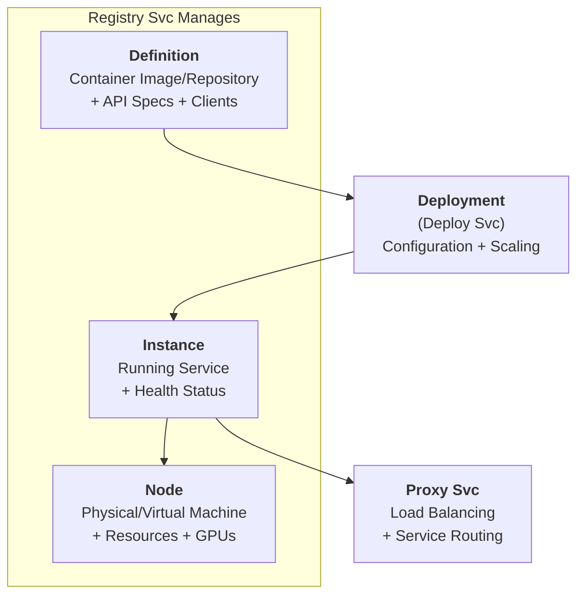

# Registry Svc

The Registry Svc is a comprehensive service discovery and registry system that manages service definitions, running instances, and distributed nodes in a microservices architecture.

> This page provides a comprehensive overview of `Registry Svc`. For detailed API information, refer to the [Registry Svc API documentation](/docs/1backend-api/register-instance).

## Architecture & Purpose

Registry Svc serves as the **service discovery backbone** for 1Backend, providing:

- **Service Definitions**: Template specifications for deployable services (images, repositories, APIs)
- **Instance Management**: Registry of running service instances with health tracking
- **Node Discovery**: Distributed node topology with resource monitoring
- **Service Discovery**: Automatic routing and load balancing for microservices
- **Health Monitoring**: Real-time status tracking with heartbeat mechanisms

### Core Entities Relationship



## CLI Usage

### Instance Management

```bash
# List all service instances
oo instances list
oo instances ls
oo i ls

# Remove a service instance
oo instances remove inst_12345
oo instances rm inst_12345
oo i rm inst_12345
```

### Definition Management

```bash
# List all service definitions
oo definitions list
oo definitions ls
oo def ls

# Save a definition from YAML file
oo definitions save my-service-def.yaml
oo def save my-service-def.yaml

# Remove a definition
oo definitions remove test-service-a
oo def rm test-service-a
```

### Node Management

```bash
# List all nodes in the cluster
oo nodes list
oo nodes ls
oo n ls

# Remove a node from the cluster
oo nodes remove http://node2.example.com:11337
oo n rm http://node2.example.com:11337
```

### HTTP API Usage

```bash
# List instances with filtering
oo get /registry-svc/instances
oo get /registry-svc/instances?slug=user-svc
oo get /registry-svc/instances?host=api-server-1

# Register a new service instance
oo put /registry-svc/instance \
  --url="http://user-service:8080" \
  --slug="user-svc"

# List service definitions
oo get /registry-svc/definitions

# Save a service definition
oo put /registry-svc/definition \
  --definition='{"id": "my-svc", "image": {"name": "nginx:latest", "internalPorts": [80]}}'

# List nodes
oo post /registry-svc/nodes

# Get current node information
oo get /registry-svc/node/self
```

## Service Definitions

### Container-Based Definitions

Service definitions specify how services can be deployed and what they provide.

#### Simple Container Definition

```yaml
# nginx-service.yaml
id: "nginx-svc"
image:
  name: "nginx:alpine"
  internalPorts: [80]
ports:
  - internal: 80
    host: 8080
envars:
  - key: "NGINX_HOST"
    value: "localhost"
  - key: "NGINX_PORT"
    value: "80"
```

#### Advanced Container Definition

```yaml
# api-service.yaml  
id: "api-svc"
image:
  name: "mycompany/api-server:v1.2.0"
  internalPorts: [8080, 9090]
ports:
  - internal: 8080
    host: 8080
  - internal: 9090  
    host: 9090
envars:
  - key: "DATABASE_URL"
    value: "postgresql://localhost:5432/mydb"
  - key: "REDIS_URL"
    value: "redis://localhost:6379"
  - key: "LOG_LEVEL"
    value: "info"
apiSpecs:
  - url: "http://api-server:8080/openapi.json"
    protocolType: "OpenAPI"
    version: "3.0.0"
    metadata:
      title: "My API Service"
      description: "REST API for my application"
clients:
  - language: "javascript"
    url: "https://npmjs.com/package/my-api-client"
  - language: "go"
    url: "https://github.com/mycompany/api-client-go"
```

### Repository-Based Definitions

```yaml
# source-based-service.yaml
id: "custom-app"
repository:
  url: "https://github.com/mycompany/custom-service.git"
  version: "v2.1.0"
  buildContext: "backend"
  containerFile: "docker/Dockerfile.prod"
  internalPorts: [3000]
envars:
  - key: "NODE_ENV"
    value: "production"
  - key: "PORT"
    value: "3000"
apiSpecs:
  - url: "/api/openapi.yaml"
    protocolType: "OpenAPI"
    version: "3.0.0"
```

### Definition Management Commands

```bash
# Save definitions
oo definitions save nginx-service.yaml
oo definitions save api-service.yaml
oo definitions save custom-app.yaml

# List all definitions
oo definitions list

# Remove a definition
oo definitions remove nginx-svc
```

## Service Instance Registration

### Manual Instance Registration

```bash
# Register a self-hosted service
oo put /registry-svc/instance \
  --url="http://user-service:8080"

# Register with custom ID and deployment reference
oo put /registry-svc/instance \
  --id="inst_custom_123" \
  --url="http://api-service:8080" \
  --deploymentId="depl_abc123"

# Register using individual components
oo put /registry-svc/instance \
  --scheme="https" \
  --host="api.example.com" \
  --port=443 \
  --path="/v1"

# Register by IP address
oo put /registry-svc/instance \
  --scheme="http" \
  --ip="192.168.1.100" \
  --port=8080
```

### Service Instance Discovery

```bash
# Find instances by service slug
oo get /registry-svc/instances?slug=user-svc

# Find instances by host
oo get /registry-svc/instances?host=api-server-1

# Find instances by deployment
oo get /registry-svc/instances?deploymentId=depl_abc123

# Find instances by node
oo get /registry-svc/instances?nodeUrl=http://node1.cluster.local:11337

# List all healthy instances
curl -H "Authorization: Bearer $TOKEN" \
  "http://localhost:11337/registry-svc/instances" | \
  jq '.instances[] | select(.status == "Healthy")'
```

### Instance Status Management

**Instance Status Values:**
- `Unknown`: Initial state, health not yet determined
- `Healthy`: Service is responding and operational
- `Unhealthy`: Service is not responding or failing health checks
- `Starting`: Service is in the process of starting up
- `Stopping`: Service is shutting down

```bash
# Monitor instance health
monitor_instances() {
  while true; do
    echo "=== Instance Health Status $(date) ==="
    
    oo get /registry-svc/instances | jq -r '.instances[] | "\(.slug // "N/A") \(.url) \(.status)"' | \
    while read -r slug url status; do
      case $status in
        "Healthy")   echo "✅ $slug ($url)" ;;
        "Unhealthy") echo "❌ $slug ($url)" ;;
        "Starting")  echo "🔄 $slug ($url)" ;;
        "Stopping")  echo "⏹️  $slug ($url)" ;;
        *)           echo "❓ $slug ($url) - $status" ;;
      esac
    done
    
    echo "---"
    sleep 10
  done
}

monitor_instances
```

## Node Management & Cluster Topology

### Node Registration & Heartbeat

Nodes automatically register themselves and send periodic heartbeats with resource information.

```bash
# View current node information
oo get /registry-svc/node/self

# List all nodes in cluster
oo nodes list

# Sample node output:
NODE ID              URL                                  LAST HEARTBEAT
prod-node-1         http://api-server-1:11337            8s ago
prod-node-2         http://api-server-2:11337            12s ago
gpu-node-1          http://gpu-server-1:11337            5s ago
```

### Node Configuration

Proper node configuration is critical for distributed deployments:

```bash
# Well-configured node environment variables
export OB_SELF_URL="http://api-server-1.internal:11337"
export OB_NODE_ID="prod-node-1"
export OB_REGION="us-east-1"
export OB_AVAILABILITY_ZONE="us-east-1a"

# Poorly configured (will cause issues)
export OB_SELF_URL="http://127.0.0.1:11337"  # Not accessible from other nodes
# Missing OB_NODE_ID (auto-generated IDs are error-prone)
```

### Node Resource Monitoring

```bash
# Get detailed node information with resource usage
get_node_resources() {
  oo get /registry-svc/node/self | jq '{
    id: .node.id,
    url: .node.url,
    region: .node.region,
    availabilityZone: .node.availabilityZone,
    cpu: .node.usage.cpu,
    memory: .node.usage.memory,
    disk: .node.usage.disk,
    gpus: .node.gpus | length
  }'
}

get_node_resources

# Monitor cluster resources
monitor_cluster_resources() {
  echo "=== Cluster Resource Usage ==="
  
  oo post /registry-svc/nodes | jq -r '.nodes[] | 
    "\(.id) CPU:\(.usage.cpu.percent)% MEM:\(.usage.memory.percent)% DISK:\(.usage.disk.percent)% GPUs:\(.gpus | length)"'
}

monitor_cluster_resources
```

### GPU Node Management

```bash
# List nodes with GPU capabilities
oo post /registry-svc/nodes | jq '.nodes[] | select(.gpus | length > 0) | {
  id: .id,
  url: .url,
  gpuCount: (.gpus | length),
  gpus: [.gpus[] | {name: .name, memory: .memoryTotal, utilization: .gpuUtilization}]
}'

# Find available GPU resources
find_available_gpus() {
  oo post /registry-svc/nodes | jq -r '.nodes[] | 
    select(.gpus | length > 0) | 
    .gpus[] | 
    select(.gpuUtilization < 50) | 
    "\(.name) (\(.memoryUsage)MB/\(.memoryTotal)MB used)"'
}

find_available_gpus
```

### Node Removal & Cleanup

```bash
# Remove a node from the cluster
oo nodes remove http://api-server-2:11337

# Clean up instances from removed nodes
cleanup_dead_instances() {
  local dead_node_url=$1
  
  echo "Cleaning up instances from dead node: $dead_node_url"
  
  # Find instances on the dead node
  dead_instances=$(oo get /registry-svc/instances | \
    jq -r ".instances[] | select(.nodeUrl == \"$dead_node_url\") | .id")
  
  # Remove each instance
  for instance_id in $dead_instances; do
    echo "Removing instance: $instance_id"
    oo instances remove "$instance_id"
  done
}

cleanup_dead_instances "http://api-server-2:11337"
```

## Service Discovery Integration

### Proxy Svc Integration

Registry Svc works seamlessly with [Proxy Svc](/docs/built-in-services/proxy-svc) for automatic service routing:

```bash
# Register a service for proxy routing
oo put /registry-svc/instance \
  --url="http://user-service:8080"

# Proxy Svc automatically discovers and routes to this instance
curl http://localhost:11337/user-svc/health
# Routes to: http://user-service:8080/user-svc/health

# Load balancing with multiple instances
oo put /registry-svc/instance --url="http://user-service-1:8080"
oo put /registry-svc/instance --url="http://user-service-2:8080"
oo put /registry-svc/instance --url="http://user-service-3:8080"

# Requests automatically load balanced across all instances
curl http://localhost:11337/user-svc/api/users
```

## Real-World Usage Examples

### 1. Microservices E-Commerce Platform

```yaml
# user-service-def.yaml
id: "user-svc"
image:
  name: "mycompany/user-service:v2.1.0"
  internalPorts: [8080]
envars:
  - key: "DATABASE_URL"
    value: "postgresql://postgres:5432/users"
  - key: "REDIS_URL"
    value: "redis://redis:6379"
apiSpecs:
  - url: "/openapi.json"
    protocolType: "OpenAPI"
    version: "3.0.0"
```

```yaml
# product-service-def.yaml
id: "product-svc"
image:
  name: "mycompany/product-service:v1.8.2"
  internalPorts: [8080]
envars:
  - key: "DATABASE_URL"
    value: "postgresql://postgres:5432/products"
  - key: "ELASTICSEARCH_URL"
    value: "http://elasticsearch:9200"
```

```yaml
# order-service-def.yaml
id: "order-svc"
image:
  name: "mycompany/order-service:v3.0.1"
  internalPorts: [8080]
envars:
  - key: "DATABASE_URL"
    value: "postgresql://postgres:5432/orders"
  - key: "PAYMENT_SERVICE_URL"
    value: "http://payment-svc:8080"
```

```bash
# Deploy the microservices
oo definitions save user-service-def.yaml
oo definitions save product-service-def.yaml
oo definitions save order-service-def.yaml

# Create deployments (handled by Deploy Svc)
# Instances automatically registered and discoverable via:
# http://localhost:11337/user-svc/*
# http://localhost:11337/product-svc/*
# http://localhost:11337/order-svc/*
```

### 2. Multi-Environment Service Management

```bash
# Development environment
setup_dev_services() {
  # Register local development services
  oo put /registry-svc/instance \
    --url="http://localhost:3001" \
    --tags='["dev", "user-service"]'
  
  oo put /registry-svc/instance \
    --url="http://localhost:3002" \
    --tags='["dev", "product-service"]'
  
  oo put /registry-svc/instance \
    --url="http://localhost:3003" \
    --tags='["dev", "order-service"]'
}

# Staging environment  
setup_staging_services() {
  oo put /registry-svc/instance \
    --url="http://staging-user-svc:8080" \
    --tags='["staging", "user-service"]'
  
  oo put /registry-svc/instance \
    --url="http://staging-product-svc:8080" \
    --tags='["staging", "product-service"]'
  
  oo put /registry-svc/instance \
    --url="http://staging-order-svc:8080" \
    --tags='["staging", "order-service"]'
}

# Production environment (handled by Deploy Svc)
# Instances automatically registered with production configuration
```

### 3. AI/ML Service Discovery

```yaml
# model-inference-def.yaml
id: "model-inference-svc"
image:
  name: "mycompany/ml-inference:gpu-v1.0.0"
  internalPorts: [8080]
envars:
  - key: "MODEL_PATH"
    value: "/models/sentiment-analysis-v2"
  - key: "BATCH_SIZE"
    value: "32"
  - key: "CUDA_VISIBLE_DEVICES"
    value: "0"
```

```bash
# Deploy to GPU nodes
oo definitions save model-inference-def.yaml

# Query GPU-enabled instances
oo get /registry-svc/instances | jq '.instances[] | 
  select(.slug == "model-inference-svc") | 
  {id: .id, url: .url, nodeUrl: .nodeUrl}'

# Find GPU availability for new deployments
oo post /registry-svc/nodes | jq '.nodes[] | 
  select(.gpus | length > 0) | 
  {id: .id, gpus: [.gpus[] | select(.gpuUtilization < 80)]}' 
```

### 4. Service Health Monitoring

```bash
# Comprehensive health monitoring script
monitor_service_health() {
  while true; do
    echo "=== Service Health Report $(date) ==="
    
    # Get all instances
    instances=$(oo get /registry-svc/instances)
    
    # Group by service slug
    echo "$instances" | jq -r '.instances[] | .slug // "unknown"' | sort | uniq | \
    while read -r service; do
      if [ "$service" != "unknown" ] && [ "$service" != "null" ]; then
        echo "Service: $service"
        
        # Count instances by status
        healthy=$(echo "$instances" | jq -r ".instances[] | select(.slug == \"$service\" and .status == \"Healthy\") | .id" | wc -l)
        unhealthy=$(echo "$instances" | jq -r ".instances[] | select(.slug == \"$service\" and .status == \"Unhealthy\") | .id" | wc -l)
        total=$(echo "$instances" | jq -r ".instances[] | select(.slug == \"$service\") | .id" | wc -l)
        
        echo "  Healthy: $healthy/$total"
        
        if [ "$unhealthy" -gt 0 ]; then
          echo "  ⚠️  Unhealthy instances:"
          echo "$instances" | jq -r ".instances[] | select(.slug == \"$service\" and .status == \"Unhealthy\") | \"    - \(.id) (\(.url))\""
        fi
        
        # Test actual connectivity
        test_url=$(echo "$instances" | jq -r ".instances[] | select(.slug == \"$service\" and .status == \"Healthy\") | .url" | head -1)
        if [ "$test_url" != "null" ] && [ -n "$test_url" ]; then
          if curl -fsSL --max-time 5 "$test_url/health" > /dev/null 2>&1; then
            echo "  ✅ Health check passed"
          else
            echo "  ❌ Health check failed"
          fi
        fi
        
        echo ""
      fi
    done
    
    sleep 30
  done
}

monitor_service_health
```

### 5. Distributed Application Discovery

```bash
# Service mesh monitoring
monitor_service_mesh() {
  echo "=== Service Mesh Topology ==="
  
  # Get all services and their instances
  oo get /registry-svc/instances | jq -r '
    .instances[] | 
    select(.slug != null) | 
    "\(.slug) \(.url) \(.status) \(.nodeUrl // "unknown")"' | \
  while read -r service url status node; do
    node_short=$(echo "$node" | sed 's|http://||' | cut -d: -f1)
    echo "$service -> $url [$status] on $node_short"
  done
  
  echo ""
  echo "=== Node Distribution ==="
  
  # Show service distribution across nodes
  oo post /registry-svc/nodes | jq -r '.nodes[] | .url' | \
  while read -r node_url; do
    node_short=$(echo "$node_url" | sed 's|http://||' | cut -d: -f1)
    instance_count=$(oo get /registry-svc/instances | jq -r ".instances[] | select(.nodeUrl == \"$node_url\") | .slug" | wc -l)
    echo "$node_short: $instance_count instances"
  done
}

monitor_service_mesh
```

### 6. Service Auto-Discovery Script

```bash
# Auto-discovery and registration for Docker Compose
auto_register_docker_services() {
  local compose_file=${1:-docker-compose.yml}
  
  echo "Auto-registering services from $compose_file"
  
  # Extract service names and ports from docker-compose.yml
  docker-compose -f "$compose_file" config | yq eval '.services | to_entries[] | 
    select(.value.ports != null) | 
    {name: .key, port: .value.ports[0] | split(":")[0]}' -o json | \
  while read -r service_config; do
    service_name=$(echo "$service_config" | jq -r '.name')
    port=$(echo "$service_config" | jq -r '.port')
    
    echo "Registering service: $service_name on port $port"
    
    oo put /registry-svc/instance \
      --url="http://$service_name:$port" \
      --tags='["docker-compose", "auto-registered"]' || \
      echo "Failed to register $service_name"
  done
}

# Usage
auto_register_docker_services "docker-compose.yml"
```

## Advanced Service Discovery Patterns

### Circuit Breaker Integration

```bash
# Monitor instance health and implement circuit breaker logic
implement_circuit_breaker() {
  local service_slug=$1
  local failure_threshold=${2:-3}
  local recovery_timeout=${3:-60}
  
  while true; do
    instances=$(oo get /registry-svc/instances?slug="$service_slug")
    
    echo "$instances" | jq -r '.instances[] | "\(.id) \(.url) \(.status)"' | \
    while read -r id url status; do
      if [ "$status" = "Unhealthy" ]; then
        # Test instance directly
        if curl -fsSL --max-time 5 "$url/health" > /dev/null 2>&1; then
          echo "Instance $id recovered, updating status"
          # Instance recovered - would need API to update status
        else
          echo "Instance $id still failing"
        fi
      fi
    done
    
    sleep 10
  done
}

implement_circuit_breaker "user-svc" 3 60
```

### Service Versioning

```yaml
# user-service-v1.yaml
id: "user-svc-v1"
image:
  name: "mycompany/user-service:v1.0.0"
  internalPorts: [8080]
envars:
  - key: "API_VERSION"
    value: "v1"
```

```yaml  
# user-service-v2.yaml
id: "user-svc-v2"
image:
  name: "mycompany/user-service:v2.0.0"
  internalPorts: [8080]
envars:
  - key: "API_VERSION"
    value: "v2"
```

```bash
# Deploy multiple versions
oo definitions save user-service-v1.yaml
oo definitions save user-service-v2.yaml

# Route traffic based on version
# V1: http://localhost:11337/user-svc-v1/*
# V2: http://localhost:11337/user-svc-v2/*
```

### Blue-Green Deployment Discovery

```bash
# Blue-green deployment management
deploy_blue_green() {
  local service_name=$1
  local new_version=$2
  
  echo "Starting blue-green deployment for $service_name:$new_version"
  
  # Deploy green version
  oo put /registry-svc/instance \
    --url="http://$service_name-green:8080" \
    --tags='["green", "staging"]'
  
  # Test green version
  if curl -f "http://$service_name-green:8080/health"; then
    echo "Green version healthy, switching traffic"
    
    # Remove blue instances
    blue_instances=$(oo get /registry-svc/instances | \
      jq -r ".instances[] | select(.tags[]? == \"blue\") | .id")
    
    for instance_id in $blue_instances; do
      oo instances remove "$instance_id"
    done
    
    # Promote green to blue
    oo put /registry-svc/instance \
      --url="http://$service_name:8080" \
      --tags='["blue", "production"]'
    
    echo "Blue-green deployment completed"
  else
    echo "Green version unhealthy, aborting deployment"
    return 1
  fi
}

deploy_blue_green "user-service" "v2.1.0"
```

## Monitoring & Observability

### Registry Health Dashboard

```bash
# Registry service health dashboard
registry_dashboard() {
  while true; do
    clear
    echo "╔══════════════════════════════════════════════════════════════╗"
    echo "║                    Registry Svc Dashboard                    ║"
    echo "╚══════════════════════════════════════════════════════════════╝"
    echo ""
    
    # Cluster overview
    echo "📊 Cluster Overview:"
    node_count=$(oo post /registry-svc/nodes | jq '.nodes | length')
    instance_count=$(oo get /registry-svc/instances | jq '.instances | length')
    definition_count=$(oo get /registry-svc/definitions | jq '.definitions | length')
    
    echo "  Nodes: $node_count"
    echo "  Instances: $instance_count"  
    echo "  Definitions: $definition_count"
    echo ""
    
    # Instance health summary
    echo "🏥 Instance Health:"
    instances=$(oo get /registry-svc/instances)
    healthy=$(echo "$instances" | jq '[.instances[] | select(.status == "Healthy")] | length')
    unhealthy=$(echo "$instances" | jq '[.instances[] | select(.status == "Unhealthy")] | length')
    unknown=$(echo "$instances" | jq '[.instances[] | select(.status == "Unknown")] | length')
    
    echo "  ✅ Healthy: $healthy"
    echo "  ❌ Unhealthy: $unhealthy"
    echo "  ❓ Unknown: $unknown"
    echo ""
    
    # Service distribution
    echo "🔀 Service Distribution:"
    echo "$instances" | jq -r '.instances[] | .slug // "unknown"' | sort | uniq -c | \
    while read -r count service; do
      echo "  $service: $count instances"
    done
    echo ""
    
    # Node resource usage
    echo "💾 Node Resources:"
    oo post /registry-svc/nodes | jq -r '.nodes[] | 
      "\(.id): CPU \(.usage.cpu.percent // 0)% | Memory \(.usage.memory.percent // 0)% | GPUs \(.gpus | length)"'
    
    echo ""
    echo "Last updated: $(date)"
    echo "Press Ctrl+C to exit"
    
    sleep 5
  done
}

registry_dashboard
```

### Automated Instance Cleanup

```bash
# Clean up dead instances
cleanup_dead_instances() {
  echo "🧹 Cleaning up dead instances..."
  
  instances=$(oo get /registry-svc/instances)
  
  echo "$instances" | jq -r '.instances[] | "\(.id) \(.url) \(.status)"' | \
  while read -r id url status; do
    if [ "$status" = "Unhealthy" ]; then
      # Test if instance is truly dead
      if ! curl -fsSL --max-time 5 "$url/health" > /dev/null 2>&1; then
        echo "Removing dead instance: $id ($url)"
        oo instances remove "$id"
      else
        echo "Instance $id recovered: $url"
      fi
    fi
  done
}

# Run cleanup every 5 minutes
while true; do
  cleanup_dead_instances
  sleep 300
done
```

### Service Dependency Mapping

```bash
# Map service dependencies
map_service_dependencies() {
  echo "🗺️  Service Dependency Map:"
  
  # Get all service instances
  instances=$(oo get /registry-svc/instances)
  
  echo "$instances" | jq -r '.instances[] | select(.slug != null) | .slug' | sort | uniq | \
  while read -r service; do
    echo ""
    echo "Service: $service"
    
    # Find instances
    service_instances=$(echo "$instances" | jq -r ".instances[] | select(.slug == \"$service\") | .url")
    
    echo "  Instances:"
    echo "$service_instances" | while read -r url; do
      echo "    - $url"
    done
    
    # Test external dependencies (simplified - would need service-specific logic)
    echo "  Dependencies:"
    for dependency in "database" "redis" "elasticsearch"; do
      if echo "$service_instances" | head -1 | xargs -I {} curl -fsSL --max-time 3 {}/dependencies 2>/dev/null | grep -q "$dependency"; then
        echo "    - $dependency ✅"
      fi
    done
  done
}

map_service_dependencies
```

## Troubleshooting

### Common Issues

#### **Service Not Discoverable**

```bash
# Check if service is registered
oo get /registry-svc/instances?slug=your-service

# Verify instance status
oo get /registry-svc/instances | jq '.instances[] | select(.slug == "your-service")'

# Test direct connectivity
curl -v http://your-service:8080/health

# Check proxy routing
curl -v http://localhost:11337/your-service/health
```

#### **Instances Showing as Unhealthy**

```bash
# Check instance endpoint directly
test_instance_health() {
  local instance_url=$1
  
  echo "Testing: $instance_url"
  
  # Basic connectivity
  if curl -fsSL --max-time 5 "$instance_url" > /dev/null; then
    echo "✅ Instance responds"
  else
    echo "❌ Instance not responding"
  fi
  
  # Health endpoint
  if curl -fsSL --max-time 5 "$instance_url/health" > /dev/null; then
    echo "✅ Health endpoint OK"
  else
    echo "❌ Health endpoint failed"
  fi
  
  # Network connectivity
  host=$(echo "$instance_url" | sed 's|http://||' | cut -d: -f1)
  port=$(echo "$instance_url" | sed 's|http://||' | cut -d: -f2)
  
  if nc -zv "$host" "$port" 2>/dev/null; then
    echo "✅ Network connectivity OK"
  else
    echo "❌ Network connectivity failed"
  fi
}

test_instance_health "http://user-service:8080"
```

#### **Node Communication Issues**

```bash
# Test node connectivity
test_node_connectivity() {
  local node_url=$1
  
  echo "Testing node: $node_url"
  
  # Basic HTTP connectivity
  if curl -fsSL --max-time 5 "$node_url/health" > /dev/null; then
    echo "✅ Node responds"
  else
    echo "❌ Node not responding"
  fi
  
  # Registry API access
  if curl -fsSL --max-time 5 "$node_url/registry-svc/node/self" > /dev/null; then
    echo "✅ Registry API accessible"
  else
    echo "❌ Registry API failed"
  fi
}

# Test all nodes
oo post /registry-svc/nodes | jq -r '.nodes[].url' | \
while read -r node_url; do
  test_node_connectivity "$node_url"
done
```

#### **Definition Deployment Issues**

```bash
# Validate definition format
validate_definition() {
  local definition_file=$1
  
  echo "Validating: $definition_file"
  
  # Check YAML syntax
  if yq eval '.' "$definition_file" > /dev/null; then
    echo "✅ YAML syntax valid"
  else
    echo "❌ YAML syntax error"
    return 1
  fi
  
  # Check required fields
  if yq eval '.id' "$definition_file" | grep -v null > /dev/null; then
    echo "✅ ID field present"
  else
    echo "❌ Missing required 'id' field"
  fi
  
  # Check image or repository
  if yq eval '.image.name' "$definition_file" | grep -v null > /dev/null; then
    echo "✅ Image specification found"
  elif yq eval '.repository.url' "$definition_file" | grep -v null > /dev/null; then
    echo "✅ Repository specification found"
  else
    echo "❌ Missing image or repository specification"
  fi
}

validate_definition "my-service-def.yaml"
```

## API Reference Summary

| Endpoint | Method | Purpose |
|----------|---------|---------|
| `/registry-svc/instances` | GET | List service instances with filtering |
| `/registry-svc/instance` | PUT | Register a new service instance |
| `/registry-svc/instance/{id}` | DELETE | Remove a service instance |
| `/registry-svc/definitions` | GET | List service definitions |
| `/registry-svc/definition` | PUT | Save a service definition |
| `/registry-svc/definition/{id}` | DELETE | Remove a service definition |
| `/registry-svc/nodes` | POST | List cluster nodes |
| `/registry-svc/node/self` | GET | Get current node information |
| `/registry-svc/node/{url}` | DELETE | Remove a node from cluster |

## Permissions & Security

```bash
# Required permissions
registry-svc:instance:view     # List and view service instances
registry-svc:instance:edit     # Register service instances
registry-svc:instance:delete   # Remove service instances
registry-svc:definition:view   # List and view service definitions
registry-svc:definition:edit   # Save service definitions
registry-svc:definition:delete # Remove service definitions
registry-svc:node:view         # List and view cluster nodes
registry-svc:node:delete       # Remove nodes from cluster

# Service isolation
# Services can only see their own instances unless they have admin privileges
# or are specifically permitted services (proxy-svc)
```

## Related Services
- **[Proxy Svc](/docs/built-in-services/proxy-svc)**: Discovers instances for load balancing and routing
- **[Container Svc](/docs/built-in-services/container-svc)**: Manages container instances on individual nodes

## Environment Variables

```bash
# Node configuration (critical for distributed deployments)
OB_SELF_URL="http://api-server-1.internal:11337"  # Node's accessible URL
OB_NODE_ID="prod-node-1"                          # Unique node identifier
OB_REGION="us-east-1"                            # Geographic region
OB_AVAILABILITY_ZONE="us-east-1a"                # Availability zone

# Poor configuration examples (avoid these)
OB_SELF_URL="http://127.0.0.1:11337"     # Not accessible from other nodes
# Missing OB_NODE_ID                      # Auto-generated IDs cause issues
```

## Production Best Practices

### Multi-Node Setup

```bash
# Node 1 configuration
export OB_SELF_URL="http://node1.cluster.local:11337"
export OB_NODE_ID="node-1"
export OB_REGION="us-east-1"
export OB_AVAILABILITY_ZONE="us-east-1a"

# Node 2 configuration  
export OB_SELF_URL="http://node2.cluster.local:11337"
export OB_NODE_ID="node-2"
export OB_REGION="us-east-1"
export OB_AVAILABILITY_ZONE="us-east-1b"

# GPU node configuration
export OB_SELF_URL="http://gpu-node1.cluster.local:11337"
export OB_NODE_ID="gpu-node-1"
export OB_REGION="us-east-1"
export OB_AVAILABILITY_ZONE="us-east-1c"
```

### Health Monitoring

```bash
# Comprehensive health monitoring
setup_health_monitoring() {
  # Monitor instance health
  ( monitor_instances ) &
  
  # Monitor node health  
  ( monitor_cluster_resources ) &
  
  # Clean up dead instances
  ( cleanup_dead_instances ) &
  
  # Registry dashboard
  registry_dashboard
}

setup_health_monitoring
```

### Service Mesh Observability

```bash
# Service mesh monitoring setup
setup_observability() {
  # Export metrics to monitoring system
  monitor_service_metrics() {
    while true; do
      # Instance metrics
      oo get /registry-svc/instances | jq '{
        total_instances: (.instances | length),
        healthy_instances: ([.instances[] | select(.status == "Healthy")] | length),
        unhealthy_instances: ([.instances[] | select(.status == "Unhealthy")] | length),
        services: ([.instances[].slug | select(. != null)] | unique | length)
      }' > /var/metrics/registry-instances.json
      
      # Node metrics
      oo post /registry-svc/nodes | jq '{
        total_nodes: (.nodes | length),
        total_gpus: ([.nodes[].gpus[]] | length),
        avg_cpu_usage: ([.nodes[].usage.cpu.percent // 0] | add / length),
        avg_memory_usage: ([.nodes[].usage.memory.percent // 0] | add / length)
      }' > /var/metrics/registry-nodes.json
      
      sleep 60
    done
  }
  
  monitor_service_metrics &
}

setup_observability
```

Registry Svc provides the foundation for distributed service architecture in 1Backend, enabling automatic service discovery, load balancing, and health monitoring across multi-node clusters with comprehensive GPU and resource management capabilities.
